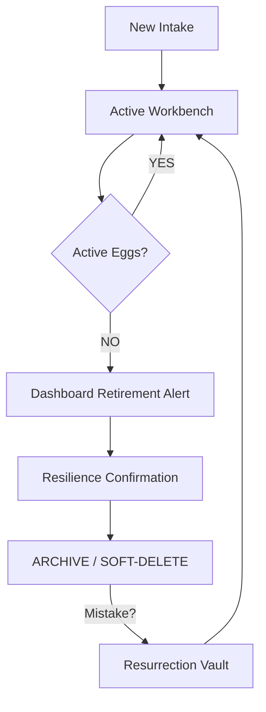

# 📖 Incubator Vault: Operator's Manual (v7.9.4)

## 1. Getting Started: The Login Splash
When you first open the Vault, you must select your name from the **Observer Identity** list.
*   **Persistent Login**: The system will remember your name for the rest of your shift.
*   **Session Handshake**: Your entry into the Command Center is logged for research integrity.

## 2. New Intake: Bringing Eggs into the Vault
Use this screen when a new clutch arrives.
1.  **Select Species**: Choose from the list of 11 protected species.
2.  **Case #**: This matches your internal WINC or DNR case number.
3.  **The Matrix**: Describe the mother's condition, the discovery location, and carapace length.
4.  **Finalize**: Clicking "Commit" will establish the Bins and Eggs in the primary ledger.

## 3. Daily Observations: The Workbench
This is your primary tool for clinical monitoring.
1.  **The Hydration Gate**: You MUST record the bin's weight before you can see the eggs. This ensures our hydration protocols are never skipped.
2.  **The 4-Column Grid**: Large icons show the status of every egg.
3.  **Biological Icons**: 
    *   **Equator Band**: Chalking (1, 2, or 3).
    *   **Red Pulse**: Vascularity detected.
    *   **Star-Crack**: Stage S5 (Pipping).
4.  **Property Matrix**: Select multiple eggs to update their Stage and Health markers in bulk.

## 4. 🔄 Lifecycle: Retirement & Resurrection (v7.9.7)
Data is never truly lost in the Vault; it simply moves between **Active** and **Archive**.

### 🗺️ The Resilience Flow

### 🧹 How to Retire a Bin (Season-End)
When a Bin has 0 active eggs (everything has hatched or been removed):
1.  Go to the **Dashboard**.
2.  Locate the **"Workbench Cleanup"** card.
3.  Select the Bin and move the **"Confirm Retirement"** slider.
4.  Click **Retire Bin**. (The data is archived and a success event is logged).

### ✨ How to Undo a Deletion (Resurrection)
If you accidentally retire a Bin or Case:
1.  Go to **Settings** > **Resurrection Vault**.
2.  Find the item in the list of retired records.
3.  Click **Restore**. The system will instantly bring the record back to your active shift.

## 5. What if an Egg Hatches? (WormD Bridge)
When an egg reaches **Stage S6 (Hatched)**:
1.  Set the stage to S6. The egg will be moved to the **Hatchling Ledger**.
2.  Data is prepared for export to the **WormD** system for pediatric care.
3.  Physical subject is moved to juvenile enclosures.

## 6. Accountability & Logs
At the bottom of the Observation screen, use the **Live Session Audit** to review your actions. This is your personal shift diary to ensure everything was logged correctly before you leave.
