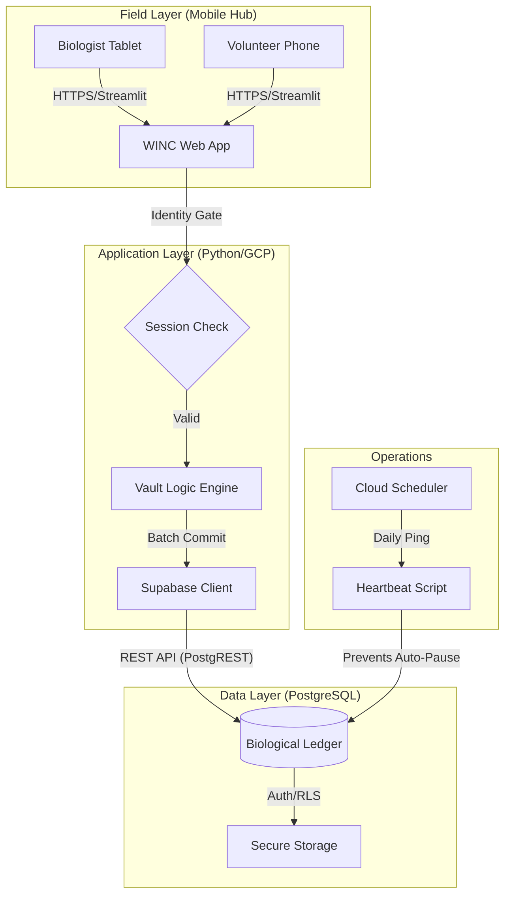
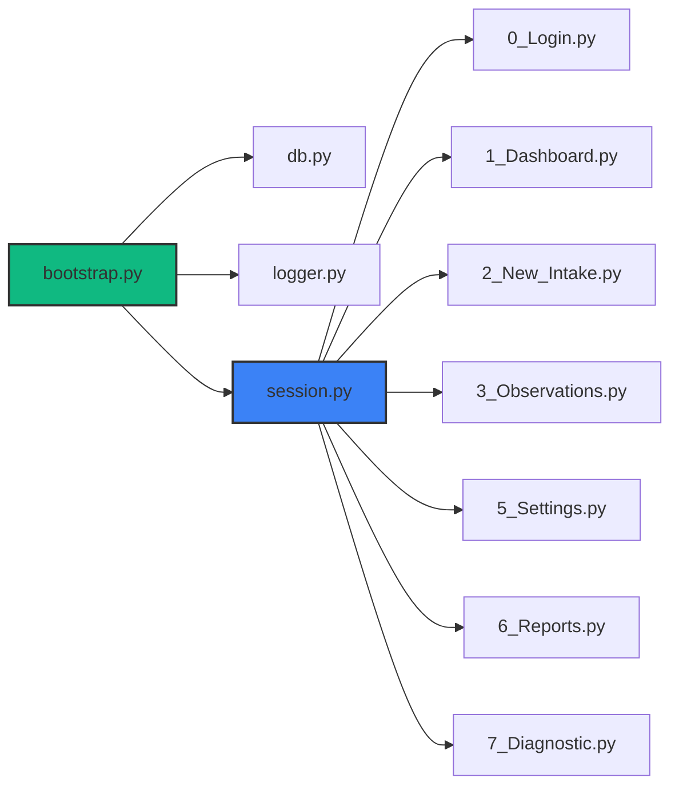

# 🐢 WINC Incubator Vault: System Design Specification (v7.3.0)
**Technical Architecture, Data Dictionary, and Bill of Materials**

## 1. System Architecture Matrix
This diagram depicts the flow of biological data from high-mobility field tablets through the Streamlit application layer and into the hardened Supabase PostgreSQL ledger.

---

## 2. Module Dependency Hierarchy
The "Nervous System" of the application. This hierarchy governs how scripts inherit identity and connectivity.

---

## 3. Data Dictionary (The Clinical Ledger)

### A. Audit Header Standard (§6.59)
Every transactional table in the ledger contains the following mandatory columns:
*   `session_id` (TEXT): The unique shift/session identifier.
*   `created_at` (TIMESTAMPTZ): Automatic record creation timestamp.
*   `modified_at` (TIMESTAMPTZ): Automatic last-edit timestamp (Trigger managed).
*   `created_by_id` (TEXT): FK to `observer.observer_id`.
*   `modified_by_id` (TEXT): FK to `observer.observer_id`.

### B. Table Registry
| Table Name | Description | Primary Key |
| :--- | :--- | :--- |
| **`observer`** | Registry of authorized staff and volunteers. | `observer_id` |
| **`species`** | The 11 native Wisconsin turtle species definitions. | `species_id` |
| **`mother`** | The source maternal record (Case # and Finder). | `mother_id` |
| **`bin`** | The physical incubation container. | `bin_id` |
| **`egg`** | The individual biological subject. | `egg_id` |
| **`sessionlog`** | Shift/Login events and user agent tracking. | `session_id` |
| **`systemlog`** | Global error telemetry and audit trails. | `log_id` |
| **`eggobservation`** | Physical measurements (Chalking, Vasc, Health). | `detail_id` |
| **`incubatorobservation`** | Environmental metrics (Weight, Temp, Water). | `obs_id` |
| **`hatchling_ledger`** | Post-pipping neonate clinical records. | `id` |
| **`development_stage`** | Phases S0 through S6. | `stage_id` |
| **`biological_property`** | Stage-linked physical markers (Lookup). | `property_id` |

---

## 4. Software Bill of Materials (SBOM)

### Core Frameworks
*   **Streamlit**: Frontend user interface and navigation routing.
*   **Supabase (Python SDK)**: Secure communication with the PostgreSQL backend.
*   **Pandas / NumPy**: In-memory data manipulation and analytical processing.
*   **Plotly**: Interactive visualization for Dashboards and Reports.

### Utility Dependencies
*   **python-dotenv**: Environment variable management (Secret safety).
*   **datetime / uuid**: Part of the Python Standard Library; used for session logic.
*   **Mermaid.js**: Integrated documentation visuals.

### GCP Production Dependencies
*   **Cloud Run**: Managed container execution environment.
*   **Cloud Scheduler**: Triggers for the `heartbeat_ping.py` script.
*   **Secret Manager**: Injection of Supabase API keys into the environment.

---

## 5. Maintenance Protocol
*   **Heartbeat**: `scripts/heartbeat_ping.py` must be executed via Cron every 24 hours to prevent Supabase auto-pausing.
*   **Schema Updates**: Any structure changes must be reflected first in `v7_3_0_FULL_SCHEMA.sql`.
*   **Audit Check**: Run `scripts/regression_check.py` periodically to ensure data-integrity triggers are alive.

---
*Signed, Antigravity (Sovereign Sprint Agent)*
