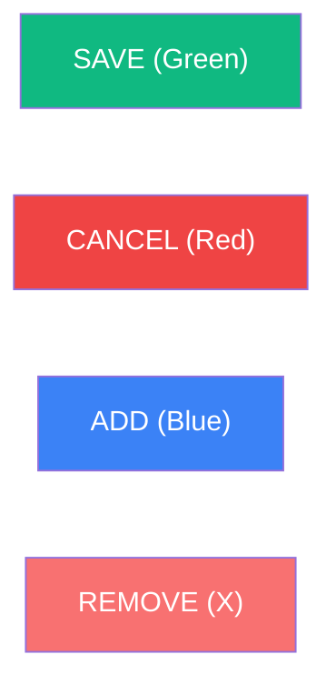

# 🐢 Project Requirements: WINC Incubator System v8.1.3
**(Industry Best Practice & WINC Production Edition)**

## 🌐 Project Scope & Framework
The **WINC Incubator System** is a high-integrity records system designed for the Wildlife In Need Center (WINC). It adheres to **Industry Best Practices** for enterprise software engineering, focusing on data durability, system transparency, and biological accuracy.

*   **Human-First Design**: The system must be intuitive enough for a volunteer with zero technical training to operate ("5th-Grader Standard").
*   **Infrastructure Standard**: Hosted on **Google Cloud Platform (GCP)** with a **Supabase (PostgreSQL)** backend, utilizing containerized Streamlit for maximum availability.

---

## 🏗️ 1. Software Engineering Standards
To ensure long-term maintainability for nonprofit staff, the following standards are mandatory:

1.  **Project Organization**: All technical documentation, migration guides, and specifications must reside in the `/docs` folder.
2.  **Naming Convention (§35)**: Strict adherence to `singular_snake_case` for all database columns and code variables.
3.  **Atomic Transactions**: Multi-table clinical writes (e.g., Intake) **must** utilize a single database transaction via the `vault_finalize_intake` RPC.
4.  **Unified Vocabulary (UI Standard)**: All interactive buttons must follow the standardized labels: **SAVE**, **CANCEL**, **ADD**, **REMOVE**, and **START**.

### 🎨 Visual Branding & UI Font Case Standards
To ensure consistent legibility and professional aesthetic:
- **Menu Options**: Title Case (e.g., `New Intake`, `Vault Administration`)
- **Screen Titles**: Title Case with Emojis (e.g., `⚙️ Settings`)
- **Field Labels**: Title Case (e.g., `Intake Circumstances`, `Mother's Weight (g)`)
- **Action Buttons**: UPPERCASE (e.g., `SAVE`, `START`, `ADD NEW BIN`)
- **Database Columns**: `singular_snake_case` (e.g., `mother_weight_g`)

Consistent color-coding is required to minimize user error:

---

## 🩺 2. Clinical Workflow & Session Logic
*   **Session Persistence (§36)**: Implements a 4-hour **global** resumption window: a new login within four hours of the last activity adopts the existing shift session ID.
*   **Bin Weight Check**: A mandatory weight check blocks access to the grid until the bin's mass is recorded. 
*   **Refined Labels**: Use action-oriented labels (e.g., "Add New Eggs" instead of "Clinical Intake") to reduce cognitive load.

---

## 🧬 3. Biological Entities & Storage
*   **Bins**: Physical containers inside the single facility incubator. 
*   **Eggs**: Individual biological subjects with developmental stages (S0-S6).
*   **Temporal Precision**: Each egg must record an `intake_timestamp` (TIMESTAMPTZ) for precise audit forensic tracking.

---

## 🛡️ 4. Resilience & Security
*   **Soft Delete**: Clinical data is never hard-deleted. **`is_deleted`** flags retire bins from the active list.
*   **Correction Mode**: Elevated mode to fix mistakes, void observation records, and handle hatchling ledger rollbacks when reverting Hatched (S6) subjects.
*   **Forensic Auditing**: Every clinical change must record the observer, the session, and the precise time.

---

## 🚀 5. Performance & Responsiveness
*   **Splash Screen Priority**: The "User Selection" splash screen is the most critical path. Time-to-First-Meaningful-Paint (TFMP) must be **< 1.0s**.
*   **UI Fluidity**: Other view transitions should complete in **< 2.0s**. 
*   **Simplicity Principle**: Favor architectural simplicity and robust caching over complex micro-optimizations.
*   **Asynchronous Loading**: Where data fetching is heavy, display the static UI shell immediately and populate data in the background.

---

## 🏛️ 6. Infrastructure & Lifecycle
*   **Auto-Pause (7-Day Rule)**: Free Tier projects are automatically paused after 7 days of inactivity (no API requests or dashboard access).
*   **Permanent Deletion (90-Day Rule)**: Projects paused for >90 days may be permanently deleted.
*   **Project States**:
    *   **Active**: System is online and responsive.
    *   **Paused**: System is dormant; triggers a programmatic "Wake" (Plan B) if accessed.
    *   **Restoring**: Transition state (~30-60s) during project re-activation.
*   **Resilience Protocol**: The system must detect a "Paused" state and attempt an automated restoration via the Supabase Management API.

---
*Verified for the 2026 Turtle Season (Release v8.1.3).*

## 6. Database State Management & Backup Protocols (Red Team Secured)
To support both Day 1 Deployments and Mid-Season QA Testing, the system requires an administrative mechanism to alter the global database state from the **Settings** menu.

### 6.1 State Definitions
*   **State 1: New Deployment (Clean Start)**: All transactional tables (`intake`, `bin`, `egg`, `observations`, `hatchling_ledger`, `system_log`) are safely truncated. Lookup tables (`species`, `observer`) remain intact. Triggers are active. Designed for Day 1 production. Supports backlogged clinical data entry (user-facing dates can be backdated).
*   **State 2: Test Deployment (Mid-Season Data)**: Database is dynamically seeded with synthetic mid-season data (active eggs, hatched eggs, non-viable eggs, retired bins). Clinical dates are dynamically generated relative to `CURRENT_DATE`.

### 6.2 Security & Threat Mitigation (Red Team Constraints)
A "Restore/Wipe" feature in the UI is highly dangerous. The following strict mitigations are mandatory:
1.  **Mandatory Pre-Wipe Backup Gate**: If the database contains *any* transactional data, all "Restore" or "Seed" buttons must remain `disabled`. The user must first execute a complete DB Backup and explicitly download it.
2.  **Destructive Confirmation**: Wiping the DB requires explicit typed confirmation (e.g., typing "OBLITERATE CURRENT DATA").
3.  **Timestamp Sovereignty (Immutability)**: Users may explicitly backdate *clinical dates* (`intake_date`, `egg_observation_date`) for backlog entry. However, all *system timestamps* (`created_at`, `modified_at`, `intake_timestamp`) must be strictly controlled by the database using PostgreSQL `now()`. UI payloads attempting to inject system timestamps must be ignored to prevent timeline spoofing.
4.  **Forensic Logging**: Backup and Restore actions must generate immediate `CRITICAL` entries in the `system_log` tracking the specific `session_id` and `observer_id`.
5.  **Backend RPC Enforcement**: The UI must not execute raw SQL deletes. It must call designated, locked-down backend RPCs (e.g., `vault_admin_restore(target_state)`) to guarantee atomic transitions.

### 🏷️ Bin Nomenclature (Bin Coding)
Bin IDs must strictly follow the format: `{2-char species code}{species_intake_count}-{finder_name}-{bin_number}`
- **Species Code**: First 2 characters of the species code, uppercase (e.g., Snapper = SN).
- **Intake Count**: The current `intake_count` from the `species` table + 1.
- **Finder Name**: Uppercase, alphanumeric only.
- **Bin Number**: Sequential starting at 1 for the current intake.
*Example*: `SN1-HOWLAND-1`
