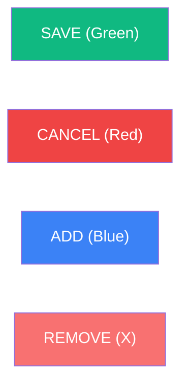

# 🐢 Project Requirements: Incubator Vault v8.1.3
**(Industry Best Practice & Clinical Sovereignty Edition)**

## 🌐 Project Scope & Framework
The **Incubator Vault** is a high-integrity clinical ledger designed for the Wildlife In Need Center (WINC). It adheres to **Industry Best Practices** for enterprise software engineering, focusing on data durability, system transparency, and biological accuracy.

*   **Human-First Design**: The system must be intuitive enough for a volunteer with zero technical training to operate ("5th-Grader Standard").
*   **Infrastructure Standard**: Hosted on **Google Cloud Platform (GCP)** with a **Supabase (PostgreSQL)** backend, utilizing containerized Streamlit for maximum availability.

---

## 🏗️ 1. Software Engineering Standards
To ensure long-term maintainability for nonprofit staff, the following standards are mandatory:

1.  **Project Organization**: All technical documentation, migration guides, and specifications must reside in the `/docs` folder.
2.  **Naming Convention (§35)**: Strict adherence to `singular_snake_case` for all database columns and code variables.
3.  **Atomic Transactions**: Multi-table clinical writes (e.g., Intake) **must** utilize a single database transaction via the `vault_finalize_intake` RPC.
4.  **Unified Vocabulary (UI Standard)**: All interactive buttons must follow the standardized labels: **SAVE**, **CANCEL**, **ADD**, **REMOVE**, and **START**.

### 🎨 Visual Branding (5th-Grader Standard)
Consistent color-coding is required to minimize user error:

---

## 🩺 2. Clinical Workflow & Session Logic
*   **Session Persistence (§36)**: Implements a 4-hour **global** resumption window: a new login within four hours of the last activity adopts the existing shift session ID.
*   **Bin Weight Check**: A mandatory weight check blocks access to the grid until the bin's mass is recorded. 
*   **Refined Labels**: Use action-oriented labels (e.g., "Add New Eggs" instead of "Clinical Intake") to reduce cognitive load.

---

## 🧬 3. Biological Entities & Storage
*   **Bins**: Physical containers inside the single facility incubator. 
*   **Eggs**: Individual biological subjects with developmental stages (S0-S6).
*   **Temporal Precision**: Each egg must record an `intake_timestamp` (TIMESTAMPTZ) for precise audit forensic tracking.

---

## 🛡️ 4. Resilience & Security
*   **Soft Delete**: Clinical data is never hard-deleted. **`is_deleted`** flags retire bins from the active list.
*   **Correction Mode**: Elevated mode to fix mistakes, void observation records, and handle hatchling ledger rollbacks when reverting Hatched (S6) subjects.
*   **Forensic Auditing**: Every clinical change must record the observer, the session, and the precise time.

---
*Verified for the 2026 Turtle Season (Release v8.1.3).*
