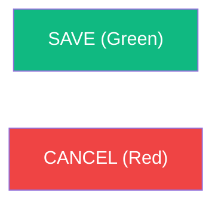

# 🐢 Project Requirements: WINC Incubator System v8.2.0

**(Industry Best Practice & WINC Production Edition)**

## 🌐 Project Scope & Framework

The **WINC Incubator System** is a high-integrity records system designed for the Wildlife In Need Center (WINC). It adheres to **Industry Best Practices** for enterprise software engineering, focusing on data durability, system transparency, and biological accuracy.

* **Human-First Design**: The system must be intuitive enough for a volunteer with zero technical training to operate ("5th-Grader Standard").
* **Architecture Standard**: Single-user-at-a-time shift model. Supports multiple observers for forensic accountability, but permits only one active clinical context at a time.
* **Infrastructure Standard**: Hosted on **Google Cloud Platform (GCP)** with a **Supabase (PostgreSQL)** backend, utilizing containerized Streamlit for maximum availability.

---

## 🏗️ 1. Software Engineering Standards

To ensure long-term maintainability for nonprofit staff, the following standards are mandatory:

1. **Project Organization**: All technical documentation, migration guides, and specifications must reside in the `/docs` folder.
2. **Naming Convention (§35)**: Strict adherence to `singular_snake_case` for all database columns and code variables.
3. **Atomic Transactions**: Multi-table clinical writes (e.g., Intake) **must** utilize a single database transaction via the `vault_finalize_intake` RPC.
4. **Database-Driven Versioning**: The application version must be defined in the `system_config` table. The UI must fetch this value dynamically via a singleton pattern on every route to ensure environment-wide consistency.
5. **Unified Vocabulary (UI Standard)**: Form action buttons must follow the standardized labels: **SAVE**, **CANCEL**, and **START**. For tabular row operations, the system must prioritize native `st.data_editor` controls. If manual tables are absolutely necessary, they must match native iconography: **➕ (Add)** and **🗑️ (Delete)**, strictly avoiding text-based buttons like "REMOVE" or "ADD NEW".

### 🎨 Visual Branding & UI Font Case Standards

To ensure consistent legibility and professional aesthetic:

* **Clean Slate Standard**: All branding assets (logos) are removed from the splash and sidebar to maximize focus and performance.
* **Loading Standard**: The custom "Hatching Turtle" (🐢) animation is the mandatory status indicator for all data operations.
* **Menu Options**: Title Case (e.g., `New Intake`, `Vault Administration`)
* **Screen Titles**: Title Case with Emojis (e.g., `⚙️ Settings`)
* **Field Labels**: Title Case (e.g., `Intake Circumstances`, `Mother's Weight (g)`)
* **Action Buttons**: UPPERCASE (e.g., `SAVE`, `START`, `ADD BIN`)
* **Database Columns**: `singular_snake_case` (e.g., `mother_weight_g`)
* **Unit Standardization**: All temperature fields must be labeled as **Fahrenheit (°F)**. Clinical ranges for these fields must be enforced (e.g., 60°F - 113°F).

Consistent color-coding is required to minimize user error:

---

## 🩺 2. Clinical Workflow & Session Logic

* **Session Persistence (§36)**: Implements a 1-hour **global** resumption window: a new login within one hour of the last activity adopts the existing shift session ID. Sessions older than 1 hour require re-authentication.
* **Bin Weight Check**: A mandatory weight check blocks access to the grid until the bin's mass is recorded.
* **Unified Identity Cluster**: User identity (Name + Version) and the **SHIFT END** session termination control must be grouped in a consolidated sidebar cluster.

---

## 🧬 3. Biological Entities & Storage

* **Bins**: Physical containers inside the single facility incubator.
* **Eggs**: Individual biological subjects with developmental stages (S0-S6).
* **Temporal Precision**: Each egg must record an `intake_timestamp` (TIMESTAMPTZ) for precise audit forensic tracking.

### §3.1 Biological Property Model
Observation metrics are defined per developmental stage in the `biological_property` lookup table. Each property specifies:
- `property_id`: Unique identifier (e.g., 's2_molding')
- `stage_id`: FK to `development_stage`
- `property_label`: Human-readable name
- `data_type`: One of NUMERIC, INTEGER_0_2, INTEGER_0_4, BOOLEAN, TEXT
- `is_critical`: Boolean flag for mandatory observations

Standard properties cover: Molding (0-4), Chalking (0-2), Vascularity, Leaking (0-4), Dented (0-4), Discolored, Moisture Deficit, Water Added, and stage-specific metrics (egg mass/diameter at S1, motion/pipping at S4, weight/umbilical/feeding at S6).

### §3.2 Stage/Sub-Stage Specification
Developmental stages follow the S0-S6 framework with sub-stages:

| Stage ID | Label | Sub-Code | Description |
|----------|-------|----------|-------------|
| S0 | Pre-Intake | — | Egg received, not yet assessed |
| S1 | Intake | — | Baseline established |
| S2 | Early Development | Spot/Band/Full | Embryo visible, organogenesis beginning |
| S3 | Mid Development | — | Limb buds forming |
| S4 | Late Development | C/Term/Motion | Pre-hatch; carapace visible to motion |
| S5 | Hatching | — | Pipping or emerging |
| S6 | Hatchling | YA1/YA2/YA3 | Post-hatch through yearling |
| SX | Non-Viable | — | Egg failed to develop |
| SD | Deceased | — | Embryo/hatchling died |
---

## 🛡️ 4. Resilience & Security

* **Soft Delete**: Clinical data is never hard-deleted. **`is_deleted`** flags retire bins from the active list.
* **Correction Mode**: Elevated mode to fix mistakes, void observation records, and handle hatchling ledger rollbacks when reverting Hatched (S6) subjects.
* **Forensic Auditing**: Every clinical change must record the observer, the session, and the precise time.
### §4.5 Bin Closure Audit
When all eggs in a bin reach a terminal state (S6-YA3, SX, or SD), the system SHALL require a final closure observation note documenting:
- Date of closure
- Final disposition of each egg
- Observer identification
- Any unresolved clinical notes

### §4.6 Biosecurity Export Gate
Eggs/hatchlings SHALL NOT be exported for WormD release until they reach stage S6-YA3 minimum. This gate prevents premature release of hatchlings that have not completed the full yearling development cycle. The export function (`wormd_export.py`) MUST enforce this stage minimum.

---

## 🚀 5. Performance & Responsiveness

* **Splash Screen Priority**: Time-to-First-Meaningful-Paint (TFMP) must be **< 1.0s**.
* **Hydration Breakthrough**: Total application hydration (including database client initialization) must complete in **< 1.5s**. This is achieved by disabling network pollers for fonts and external IP discovery.
* **UI Fluidity**: Other view transitions should complete in **< 2.0s**.

---

## 🏛️ 6. Infrastructure & Lifecycle

* **Auto-Pause (7-Day Rule)**: Free Tier projects are automatically paused after 7 days of inactivity.
* **Resilience Protocol**: The system must detect a "Paused" state and attempt an automated restoration via the Supabase Management API.

---

## 📱 7. Mobile-First Ergonomics ("Tight-Fit")

To ensure production usability on clinical floor mobile devices:

1. **Vertical Flush**: The page body content must be vertically aligned with the top edge of the navigation menu items.
2. **Width Optimization**: Side margins (left/right) are minimized to **0.8rem** to prevent content cramping.
3. **Responsive Sliding**: The page body must dynamically slide left and expand horizontally when the sidebar menu is collapsed, maintaining a tight-fit relationship with the physical viewport edges.

---
*Verified for the 2026 Turtle Season (Release v8.2.0).*

## 8. Database State Management & Backup Protocols (Red Team Secured)

### 8.1 State Definitions

* **State 1: New Deployment (Clean Start)**: All transactional tables are safely truncated. Lookup tables remain intact.
* **State 2: Test Deployment (Mid-Season Data)**: Database is dynamically seeded with synthetic mid-season data.

### 8.2 Security & Threat Mitigation

1. **Mandatory Pre-Wipe Backup Gate**: All destructive buttons remain locked until a full DB Backup is downloaded.
2. **Destructive Confirmation**: Requires explicit typed confirmation: "OBLITERATE CURRENT DATA".
3. **Timestamp Sovereignty**: System timestamps are immutable and generated exclusively by the database.

### 🏷️ Bin Nomenclature (Bin Coding)

Bin IDs format: `{SpeciesCode}{NextIntakeNumber}-{CleanFinderName}-{BinNum}`
*Example*: `SN1-HOWLAND-1`

---

## 🧪 9. High-Fidelity QA & Testing Standards

To ensure the system performs reliably under actual clinical conditions, all automated testing must adhere to the **High-Fidelity Principle**:

1. **Workflow Mimicry**: Test suites must not interact with the database via raw SQL bypasses to skip broken application logic. Every test case must mimic the exact sequence of clicks, inputs, and button presses a user performs on the UI (using `AppTest` or equivalent).
2. **Standard Functional Coverage**: For every clinical screen and function, tests must verify the full lifecycle: **START**, **SAVE**, **CANCEL**, and **SOFT DELETE**.
3. **End-to-End Validation**: A "Pass" is defined as:
   - UI success feedback (Green notifications/balloons).
   - Database verification (SQL SELECTs confirming expected row counts and field values).
   - UI Persistence (Viewing the saved data back on the relevant screen).
4. **Data Seed Generation**: Mid-season test data (State 2) must be generated by executing the actual system UI workflows. This ensures the synthetic state is structurally identical to real-world production data.
