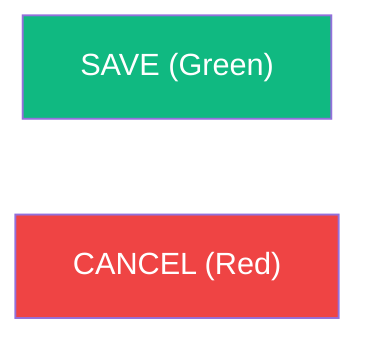

# 🐢 Project Requirements: WINC Incubator System v8.1.5

**(Industry Best Practice & WINC Production Edition)**

## 🌐 Project Scope & Framework

The **WINC Incubator System** is a high-integrity records system designed for the Wildlife In Need Center (WINC). It adheres to **Industry Best Practices** for enterprise software engineering, focusing on data durability, system transparency, and biological accuracy.

* **Human-First Design**: The system must be intuitive enough for a volunteer with zero technical training to operate ("5th-Grader Standard").
* **Infrastructure Standard**: Hosted on **Google Cloud Platform (GCP)** with a **Supabase (PostgreSQL)** backend, utilizing containerized Streamlit for maximum availability.

---

## 🏗️ 1. Software Engineering Standards

To ensure long-term maintainability for nonprofit staff, the following standards are mandatory:

1. **Project Organization**: All technical documentation, migration guides, and specifications must reside in the `/docs` folder.
2. **Naming Convention (§35)**: Strict adherence to `singular_snake_case` for all database columns and code variables.
3. **Atomic Transactions**: Multi-table clinical writes (e.g., Intake) **must** utilize a single database transaction via the `vault_finalize_intake` RPC.
4. **Database-Driven Versioning**: The application version must be defined in the `system_config` table. The UI must fetch this value dynamically via a singleton pattern on every route to ensure environment-wide consistency.
5. **Unified Vocabulary (UI Standard)**: Form action buttons must follow the standardized labels: **SAVE**, **CANCEL**, and **START**. For tabular row operations, the system must prioritize native `st.data_editor` controls. If manual tables are absolutely necessary, they must match native iconography: **➕ (Add)** and **🗑️ (Delete)**, strictly avoiding text-based buttons like "REMOVE" or "ADD NEW".

### 🎨 Visual Branding & UI Font Case Standards

To ensure consistent legibility and professional aesthetic:
* **Clean Slate Standard**: All branding assets (logos) are removed from the splash and sidebar to maximize focus and performance.
* **Loading Standard**: The custom "Hatching Turtle" (🐢) animation is the mandatory status indicator for all data operations.
* **Menu Options**: Title Case (e.g., `New Intake`, `Vault Administration`)
* **Screen Titles**: Title Case with Emojis (e.g., `⚙️ Settings`)
* **Field Labels**: Title Case (e.g., `Intake Circumstances`, `Mother's Weight (g)`)
* **Action Buttons**: UPPERCASE (e.g., `SAVE`, `START`, `ADD BIN`)
* **Database Columns**: `singular_snake_case` (e.g., `mother_weight_g`)

Consistent color-coding is required to minimize user error:

---

## 🩺 2. Clinical Workflow & Session Logic

* **Session Persistence (§36)**: Implements a 4-hour **global** resumption window: a new login within four hours of the last activity adopts the existing shift session ID.
* **Bin Weight Check**: A mandatory weight check blocks access to the grid until the bin's mass is recorded.
* **Unified Identity Cluster**: User identity (Name + Version) and the **SHIFT END** session termination control must be grouped in a consolidated sidebar cluster.

---

## 🧬 3. Biological Entities & Storage

* **Bins**: Physical containers inside the single facility incubator.
* **Eggs**: Individual biological subjects with developmental stages (S0-S6).
* **Temporal Precision**: Each egg must record an `intake_timestamp` (TIMESTAMPTZ) for precise audit forensic tracking.

---

## 🛡️ 4. Resilience & Security

* **Soft Delete**: Clinical data is never hard-deleted. **`is_deleted`** flags retire bins from the active list.
* **Correction Mode**: Elevated mode to fix mistakes, void observation records, and handle hatchling ledger rollbacks when reverting Hatched (S6) subjects.
* **Forensic Auditing**: Every clinical change must record the observer, the session, and the precise time.

---

## 🚀 5. Performance & Responsiveness

* **Splash Screen Priority**: Time-to-First-Meaningful-Paint (TFMP) must be **< 1.0s**.
* **Hydration Breakthrough**: Total application hydration (including database client initialization) must complete in **< 1.5s**. This is achieved by disabling network pollers for fonts and external IP discovery.
* **UI Fluidity**: Other view transitions should complete in **< 2.0s**.

---

## 🏛️ 6. Infrastructure & Lifecycle

* **Auto-Pause (7-Day Rule)**: Free Tier projects are automatically paused after 7 days of inactivity.
* **Resilience Protocol**: The system must detect a "Paused" state and attempt an automated restoration via the Supabase Management API.

---

## 📱 7. Mobile-First Ergonomics ("Tight-Fit")

To ensure production usability on clinical floor mobile devices:

1. **Vertical Flush**: The page body content must be vertically aligned with the top edge of the navigation menu items.
2. **Width Optimization**: Side margins (left/right) are minimized to **0.8rem** to prevent content cramping.
3. **Responsive Sliding**: The page body must dynamically slide left and expand horizontally when the sidebar menu is collapsed, maintaining a tight-fit relationship with the physical viewport edges.

---
*Verified for the 2026 Turtle Season (Release v8.1.5).*

## 8. Database State Management & Backup Protocols (Red Team Secured)

### 8.1 State Definitions

* **State 1: New Deployment (Clean Start)**: All transactional tables are safely truncated. Lookup tables remain intact.
* **State 2: Test Deployment (Mid-Season Data)**: Database is dynamically seeded with synthetic mid-season data.

### 8.2 Security & Threat Mitigation

1. **Mandatory Pre-Wipe Backup Gate**: All destructive buttons remain locked until a full DB Backup is downloaded.
2. **Destructive Confirmation**: Requires explicit typed confirmation: "OBLITERATE CURRENT DATA".
3. **Timestamp Sovereignty**: System timestamps are immutable and generated exclusively by the database.

### 🏷️ Bin Nomenclature (Bin Coding)

Bin IDs format: `{SpeciesCode}{NextIntakeNumber}-{CleanFinderName}-{BinNum}`
*Example*: `SN1-HOWLAND-1`
