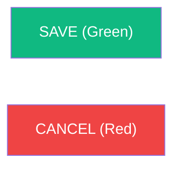

# 🐢 Project Requirements: WINC Incubator System v9.8.x

**(Industry Best Practice & WINC Production Edition)**

## 🌐 Project Scope & Framework

The **WINC Incubator System** is a high-integrity records system designed for the Wildlife In Need Center (WINC). It adheres to **Industry Best Practices** for enterprise software engineering, focusing on data durability, system transparency, and biological accuracy.

* **Human-First Design**: The system must be intuitive enough for a volunteer with zero technical training to operate ("5th-Grader Standard").
* **Architecture Standard**: Single-user-at-a-time shift model. Supports multiple observers for forensic accountability, but enforces **Global Data Visibility**—all active incubator records are visible to all authenticated observers.
* **Infrastructure Standard**: Hosted on **Supabase (PostgreSQL)** backend with a **React (TypeScript) frontend** served via **Vite**. Authentication via **Google OAuth** (Supabase Auth).

---

## 🏗️ 1. Software Engineering Standards

To ensure long-term maintainability for nonprofit staff, the following standards are mandatory:

1. **Project Organization**: All technical documentation, migration guides, and specifications must reside in the `/docs` folder. Change requests live in `/change_requests`. Knowledge base entries live in `/obsidian`.
2. **Naming Convention (§35)**: Strict adherence to `singular_snake_case` for all database columns and code variables.
3. **Atomic Transactions**: Multi-table clinical writes (e.g., Intake) **must** utilize a single database transaction via a Supabase RPC (e.g., `vault_finalize_intake`).
4. **Database-Driven Versioning**: The application version must be defined in the `system_config` table. The UI must fetch this value dynamically via a singleton pattern on every route to ensure environment-wide consistency.
5. **Unified Vocabulary (UI Standard)**: Form action buttons must follow the standardized labels: **SAVE**, **CANCEL**, and **START**. Table row operations use **➕ (Add)** and **🗑️ (Delete)** icons, strictly avoiding text-based buttons like "REMOVE" or "ADD NEW".
6. **Numeric Surrogate Keys (DB §36)**: All Primary Key (PK) and Foreign Key (FK) columns must be numeric and system-generated (`BIGINT GENERATED ALWAYS AS IDENTITY`) for uniqueness and referential integrity. Human-readable codes (e.g., bin codes, egg stage names) must be stored in separate `text` columns (`bin_code`, `egg_stage_code`). PK/FK columns are for system use only and are typically not displayed to users.
7. **Soft Delete**: Clinical data is never hard-deleted. **`is_deleted`** boolean flags retire records from the active list.

### 🎨 Visual Branding & UI Font Case Standards

To ensure consistent legibility and professional aesthetic:

* **Clean Slate Standard**: All branding assets (logos) are removed from the splash and sidebar to maximize focus and performance.
* **Loading Standard**: The custom "Hatching Turtle" (🐢) animation is the mandatory status indicator for all data operations.
* **Menu Options**: Title Case (e.g., `New Intake`, `Vault Administration`)
* **Screen Titles**: Title Case with Emojis (e.g., `⚙️ Settings`)
* **Field Labels**: Title Case (e.g., `Intake Circumstances`, `Mother's Weight (g)`)
* **Action Buttons**: UPPERCASE (e.g., `SAVE`, `START`, `ADD BIN`)
* **Database Columns**: `singular_snake_case` (e.g., `mother_weight_g`)
* **Unit Standardization**: All temperature fields must be labeled as **Fahrenheit (°F)**. Clinical ranges for these fields must be enforced (e.g., 60°F - 113°F).

Consistent color-coding is required to minimize user error:


```mermaid
graph LR
    SAVE["SAVE (Green)"]
    CANCEL["CANCEL (Red)"]
    style SAVE fill:#10b981,color:#fff
    style CANCEL fill:#ef4444,color:#fff
```

---

## 🩺 2. Clinical Workflow & Session Logic

* **Session Persistence (§36)**: Implements a 1-hour **global** resumption window: a new login within one hour of the last activity adopts the existing shift session ID. Sessions older than 1 hour require re-authentication.
* **Bin Weight Check**: A mandatory weight check blocks access to the grid until the bin's mass is recorded.
* **Unified Identity Cluster**: User identity (Name + Version) and the **SHIFT END** session termination control must be grouped in a consolidated sidebar cluster.
* **Global Clinical Visibility (§2.4)**: The WINC Incubator is a **Single-User, Global Visibility system.** All active bins and eggs are sovereign to the incubator facility, not the individual observer. Clinical views (Dashboard, Observations, Intake) must display all active incubator data globally. Filtering by `observer_id` or `created_by_id` is strictly prohibited for clinical visibility and is reserved exclusively for forensic auditing and log reporting.
* **Google OAuth Authentication**: Login is handled via Supabase Auth with Google OAuth provider. The `Login.tsx` page triggers `supabase.auth.signInWithOAuth({ provider: 'google' })`. On callback, the user's email/name is used to find or create an observer record. No local password storage.

---

## 🧬 3. Biological Entities & Storage

The database schema consists of the following core tables (as of v9.8.x):

### Core Clinical Tables

| Table | Purpose | Key Columns |
|---|---|---|
| `intake` | Single intake event (mother/species/date) | `intake_id` (PK), `intake_number`, `species_id`, `mother_weight_g`, `disp_date`, `scl`, `intake_circumstances`, `session_id`, `intake_timestamp` |
| `bin` | Physical incubator bin | `bin_id` (PK), `bin_code`, `bin_temperature_f`, `bin_humidity`, `intake_id`, `session_id`, `is_deleted`, `status` |
| `egg` | Individual egg | `egg_id` (PK), `bin_id`, `intake_id`, `egg_stage_code`, `intake_timestamp`, `session_id` |
| `bin_observation` | Observation record for a bin | `bin_obs_id` (PK), `bin_id`, `observer_id`, `temperature_f`, `humidity`, `notes`, `session_id`, `obs_timestamp` |
| `egg_observation` | Observation record for an egg | `egg_obs_id` (PK), `egg_id`, `egg_stage_code`, `observer_id`, `property_id`, `obs_value`, `session_id`, `obs_timestamp` |
| `hatchling_ledger` | Post-hatch tracking | `hatchling_id` (PK), `egg_id`, `observer_id`, `stage_code`, `weight_g`, `notes`, `session_id` |

### Lookup & Audit Tables

| Table | Purpose |
|---|---|
| `species` | Species reference (common_name, scientific_name, incubation ranges) |
| `development_stage` | Stage definitions (S0-S6, SX, SD with sub-stages) |
| `biological_property` | Per-stage observation metrics (data_type, is_critical) |
| `observer` | Personnel records (name, email, role) |
| `session_log` | Shift session tracking (session_id PK, user_name, login_timestamp) |
| `system_config` | Key-value app configuration (version, thresholds) |
| `system_log` | Forensic event audit trail (event_type, payload, session_id) |

### §3.1 Biological Property Model

Observation metrics are defined per developmental stage in the `biological_property` lookup table. Each property specifies:
* `property_id`: Unique identifier (e.g., 's2_molding')
* `stage_id`: FK to `development_stage`
* `property_label`: Human-readable name
* `data_type`: One of NUMERIC, INTEGER_0_2, INTEGER_0_4, BOOLEAN, TEXT
* `is_critical`: Boolean flag for mandatory observations

Standard properties cover: Molding (0-4), Chalking (0-2), Vascularity, Leaking (0-4), Dented (0-4), Discolored, Moisture Deficit, Water Added, and stage-specific metrics (egg mass/diameter at S1, motion/pipping at S4, weight/umbilical/feeding at S6).

### §3.2 Stage/Sub-Stage Specification

Developmental stages follow the S0-S6 framework with sub-stages:

| Stage ID | Label | Sub-Code | Description |
|---|---|---|---|
| S0 | Pre-Intake | — | Egg received, not yet assessed |
| S1 | Intake | — | Baseline established |
| S2 | Early Development | Spot/Band/Full | Embryo visible, organogenesis beginning |
| S3 | Mid Development | — | Limb buds forming |
| S4 | Late Development | C/Term/Motion | Pre-hatch; carapace visible to motion |
| S5 | Hatching | — | Pipping or emerging |
| S6 | Hatchling | YA1/YA2/YA3 | Post-hatch through yearling |
| SX | Non-Viable | — | Egg failed to develop |
| SD | Deceased | — | Embryo/hatchling died |

### §3.3 Key Schema Details

All primary keys use `bigint GENERATED ALWAYS AS IDENTITY` for numeric surrogate keys.
Foreign key relationships are explicitly defined with named constraints.
Timestamps are `timestamp with time zone` (TIMESTAMPTZ) and default to `now()`.
Clinical records use `session_id` as FK to `session_log` for forensic traceability.

---

## 🛡️ 4. Resilience & Security

* **Soft Delete**: Clinical data is never hard-deleted. **`is_deleted`** flags retire bins from the active list.
* **Correction Mode**: Elevated mode to fix mistakes, void observation records, and handle hatchling ledger rollbacks when reverting Hatched (S6) subjects.
* **Forensic Auditing**: Every clinical change must record the observer, the session, and the precise time.
* **Row-Level Security (RLS)**: Supabase RLS policies are enabled on all clinical tables. Authenticated users have SELECT access. INSERT/UPDATE requires matching RPC functions (no direct table writes from the client).
* **Immutability**: System timestamps are generated exclusively by the database (`DEFAULT now()`). The frontend never sends timestamps.

### §4.5 Bin Closure Audit

When all eggs in a bin reach a terminal state (S6-YA3, SX, or SD), the system SHALL require a final closure observation note documenting:
* Date of closure
* Final disposition of each egg
* Observer identification
* Any unresolved clinical notes

### §4.6 Biosecurity Export Gate

Eggs/hatchlings SHALL NOT be exported for WormD release until they reach stage S6-YA3 minimum. This gate prevents premature release of hatchlings that have not completed the full yearling development cycle.

---

## 🚀 5. Performance & Responsiveness

* **Splash Screen Priority**: Time-to-First-Meaningful-Paint (TFMP) must be **< 1.0s**.
* **Hydration Breakthrough**: Total application hydration (including Supabase client initialization) must complete in **< 1.5s**.
* **UI Fluidity**: View transitions should complete in **< 2.0s**.

---

## 🏛️ 6. Infrastructure & Lifecycle

* **Frontend**: React 19 + TypeScript + Vite (see `frontend/package.json`)
* **Backend**: Supabase PostgreSQL (managed via Supabase dashboard and local `supabase/` migrations)
* **Auth**: Supabase Auth with Google OAuth provider
* **Deployment**: Supabase backend + Vite-built static frontend (deployed to Supabase Hosting or alternative static host)
* **Auto-Pause (7-Day Rule)**: Free Tier Supabase projects are automatically paused after 7 days of inactivity.
* **Resilience Protocol**: The system must detect a "Paused" state and attempt an automated restoration via the Supabase Management API.

---

## 📱 7. Mobile-First Ergonomics ("Tight-Fit")

To ensure production usability on clinical floor mobile devices:

1. **Vertical Flush**: The page body content must be vertically aligned with the top edge of the navigation menu items.
2. **Width Optimization**: Side margins (left/right) are minimized to **0.8rem** to prevent content cramping.
3. **Responsive Sliding**: The page body must dynamically slide left and expand horizontally when the sidebar menu is collapsed, maintaining a tight-fit relationship with the physical viewport borders.

---

## 🏷️ 8. Bin Nomenclature (Bin Coding)

Bin codes format: `{SpeciesCode}{NextIntakeNumber}-{CleanFinderName}-{BinNum}`
*Example*: `SN1-HOWLAND-1`

---

## 🧪 9. High-Fidelity QA & Testing Standards

To ensure the system performs reliably under actual clinical conditions, all automated testing must adhere to the **High-Fidelity Principle**:

1. **Workflow Mimicry**: Test suites must not interact with the database via raw SQL bypasses to skip broken application logic. Every test case must mimic the exact sequence of clicks, inputs, and button presses a user performs on the UI (using AppTest or Playwright).
2. **Standard Functional Coverage**: For every clinical screen and function, tests must verify the full lifecycle: **START**, **SAVE**, **CANCEL**, and **SOFT DELETE**.
3. **End-to-End Validation**: A "Pass" is defined as:
   * UI success feedback (Green notifications).
   * Database verification (SQL SELECTs confirming expected row counts and field values).
   * UI Persistence (Viewing the saved data back on the relevant screen).
4. **Data Seed Generation**: Mid-season test data must be generated by executing the actual system UI workflows via Playwright. This ensures the synthetic state is structurally identical to real-world production data.
5. **QA Triad Methodology**: The project uses the QA Triad (PM + DB Auditor + UI Scripter) with TSDQ governance. See `/tests/QA_TRIAD_LEDGER.md` for the full protocol.

---

## 📝 10. Knowledge Management (Obsidian)

All bug fixes, refactors, and QA session results are documented in `/obsidian/` as Markdown files with YAML frontmatter tags. This serves as the project's **persistent knowledge base** to prevent regression loops and preserve context across sessions. Key conventions:

* Files use descriptive, dated titles (e.g., `QA_Triad_v3_Final_Report_20260521.md`)
* Tags enable cross-referencing (e.g., `qa-triad`, `tsk-04`, `session-persistence`)
* Breadcrumb files (`docs/BREADCRUMB_*.md`) preserve session state at key checkpoints
* Change requests are tracked in `/change_requests/` with sequential ISO timestamps

---

## 📂 11. Project Layout

```
turtle-db/
├── app.py                          # Streamlit entry point (DEPRECATED — React only)
├── frontend/                       # React + Vite + TypeScript UI
│   ├── src/
│   │   ├── App.tsx                 # Router & layout
│   │   ├── main.tsx                # Entry point
│   │   ├── pages/                  # Dashboard, Intake, Observations, Reports, Settings, Login, Help, SystemCheck
│   │   ├── components/             # Sidebar, shared components
│   │   ├── context/                # SessionContext (React context for observer/session)
│   │   ├── hooks/                  # useVersion
│   │   └── lib/                    # supabase.ts (client singleton), identity.ts (session persistence)
│   └── package.json
├── supabase_db/                    # Migration files and schema dumps
│   ├── migrations/
│   └── turtledb_schema_generated_*.txt
├── change_requests/                # Timestamped change request documents
├── obsidian/                       # Knowledge base (bug logs, QA reports, refactors)
├── docs/                           # Design docs, deployment guides, user manual
├── tests/                          # QA Triad tests (Playwright E2E + Python unit)
└── scripts/                        # Migration runners, backup scripts, seed generators
```

---
*Verified for the 2026 Turtle Season (Release v9.8.x).*
