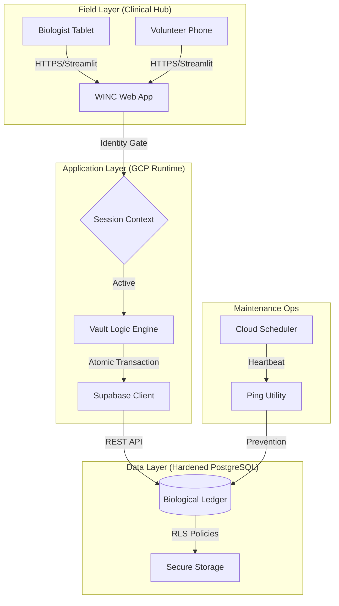
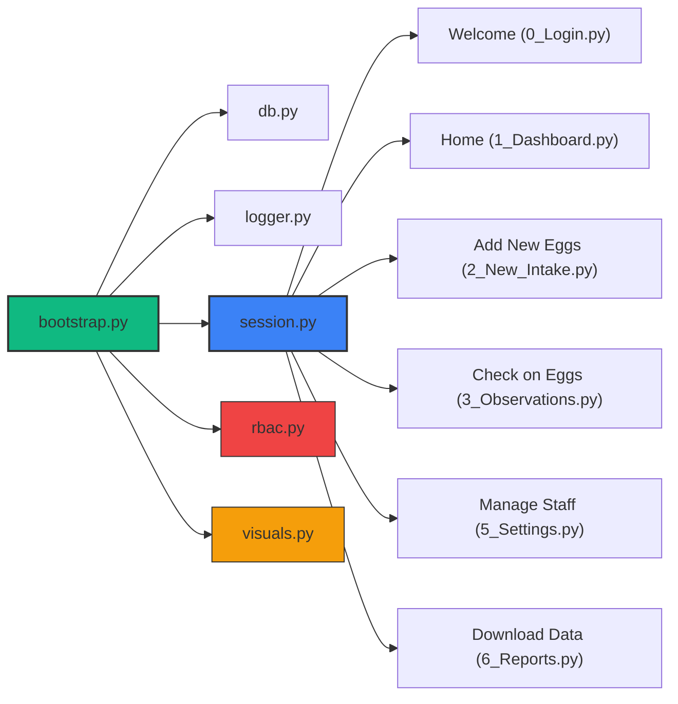
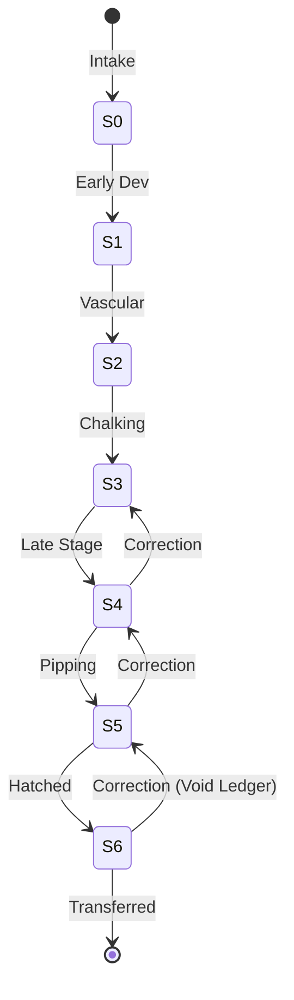
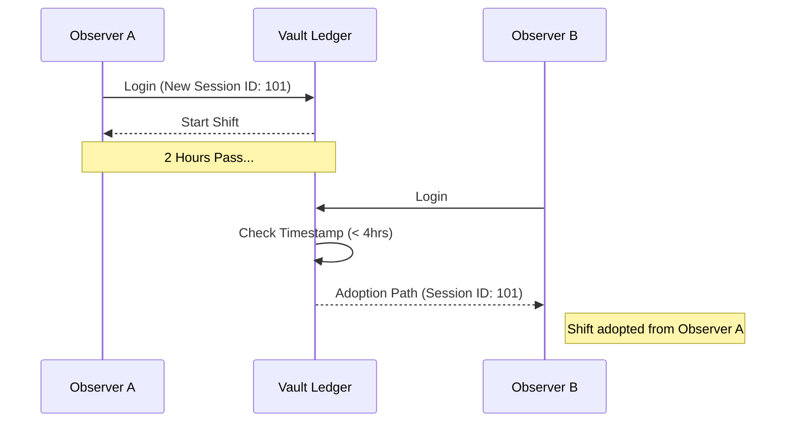

# 🐢 WINC Incubator Vault: System Design Specification (v8.1.3)
**Technical Architecture, Data Dictionary, and Clinical Bill of Materials**

## 1. System Architecture Matrix
This diagram depicts the zero-deviation flow of biological data from high-mobility field tablets through the Streamlit application layer and into the hardened Supabase PostgreSQL ledger.

---

## 2. Module Dependency Hierarchy
The "Nervous System" of the application. This hierarchy governs how scripts inherit identity and connectivity.

---

## 3. Biological State Machine
Individual eggs progress through the ledger according to the following state logic. "Correction Mode" permits manual state reversal while maintaining the audit trail.

---

## 4. Shift Continuity Timeline
The Vault unifies multi-observer activity during a 4-hour clinical window to ensure a coherent "Shift Folder" for forensics.

---

## 5. Data Dictionary (The Clinical Ledger)

### A. Audit Header Standard (§6.59)
Every transactional table in the ledger contains the following mandatory columns:
*   **`session_id`** (TEXT): The unique shift/session identifier.
*   **`created_at`** (TIMESTAMPTZ): Automatic record creation timestamp.
*   **`modified_at`** (TIMESTAMPTZ): Automatic last-edit timestamp.
*   **`created_by_id`** (UUID): FK to `observer.observer_id`.
*   **`modified_by_id`** (UUID): FK to `observer.observer_id`.
*   **`is_deleted`** (BOOLEAN): Soft-delete flag for clinical preservation.

### B. Session Continuity Protocol (§36)
The implementation utilizes a **Global Resumption** mechanism:
1.  **Persistence**: Browsing sessions are validated against the `session_log`.
2.  **Resumption**: Any new authentication within 4 hours of the *global* last activity adopts the existing `session_id`.
3.  **Traceability**: Session adoption unifies the "Shift Folder" in reporting while identifying multiple observers in shared shifts.

### C. Unified Vocabulary (v8.1.3 Standard)
The system mandates the following button labeling for cross-module consistency:
*   **`SAVE`**: Primary database commit action (Green).
*   **`CANCEL`**: Transaction abort/exit action (Red/Secondary).
*   **`ADD`**: Row or record creation (Blue).
*   **`REMOVE`**: Soft-delete or row removal action.
*   **`START` / `START WORKING`**: Gateway or check-in completion.

---

## 4. Hardware and Environment Specification
- **Incubator Topology**: SINGLE Physical Unit.
- **Organization**: Multiple "Bins" (Containers) per Incubator.
- **Terminology**: The word "Incubator" is reserved for the machine; "Bin" is used for the plastic egg boxes.

---

## 5. Software Bill of Materials (SBOM)

### Core Frameworks
*   **Streamlit (1.35+)**: Frontend user interface and navigation routing.
*   **Supabase (2.4+)**: Secure communication with the PostgreSQL backend.
*   **Pandas**: Analytical data processing.
*   **Plotly**: Interactive visualization.

---

## 6. Maintenance Protocol
*   **Heartbeat**: `scripts/heartbeat_ping.py` must be executed via Cron every 24 hours.
*   **Atomic Intake**: All clutches must be committed via `vault_finalize_intake` RPC to ensure maternal/bin/egg parity.
*   **Temporal Precision**: Eggs use `intake_timestamp` (TIMESTAMPTZ) for sub-second audit forensic tracking.

---
*Verified for v8.1.3 Production Release (2026 Season)*
