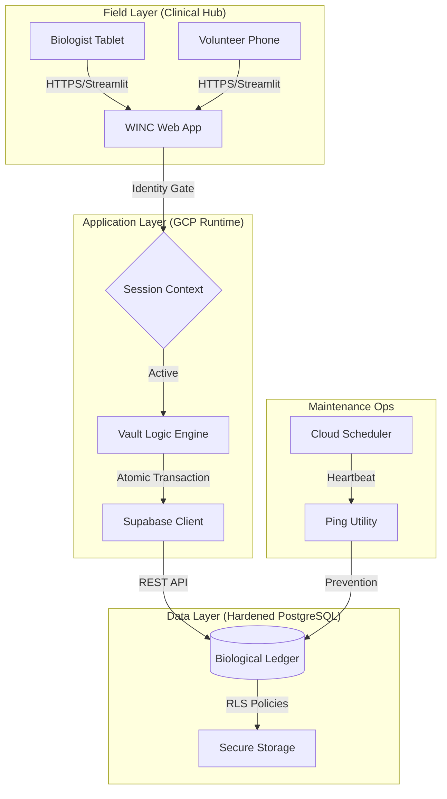
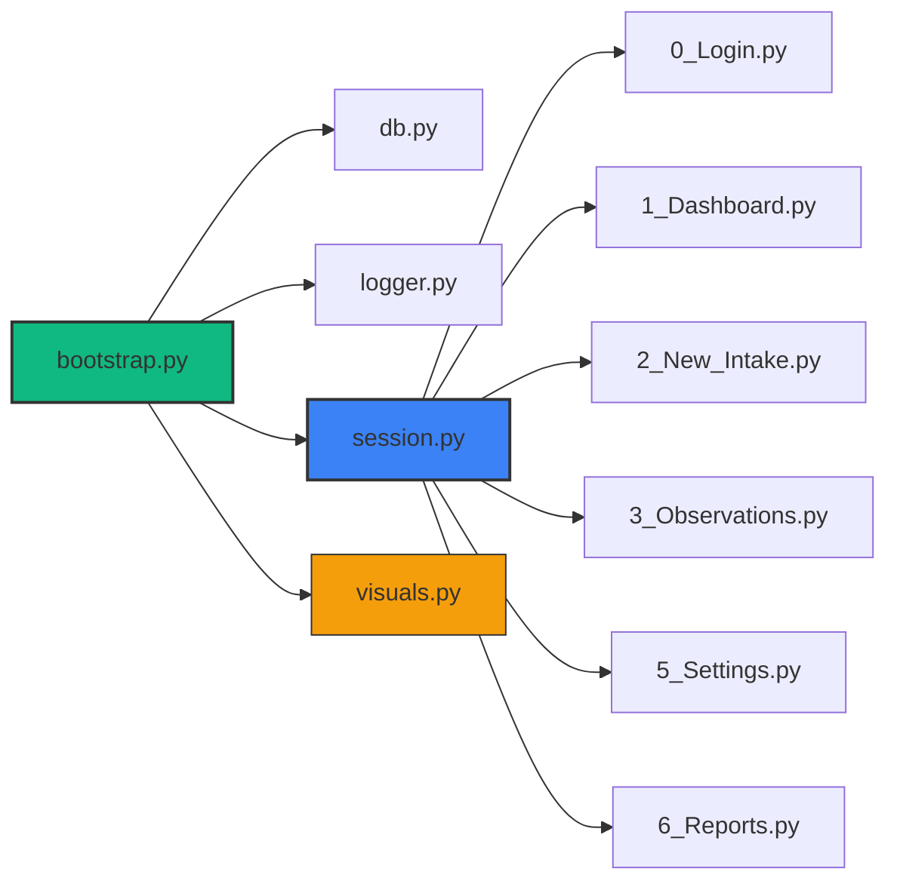

# 🐢 WINC Incubator Vault: System Design Specification (v8.0.0)
**Technical Architecture, Data Dictionary, and Clinical Bill of Materials**

## 1. System Architecture Matrix
This diagram depicts the zero-deviation flow of biological data from high-mobility field tablets through the Streamlit application layer and into the hardened Supabase PostgreSQL ledger.

---

## 2. Module Dependency Hierarchy
The "Nervous System" of the application. This hierarchy governs how scripts inherit identity and connectivity.

---

## 3. Data Dictionary (The Clinical Ledger)

### A. Audit Header Standard (§6.59)
Every transactional table in the ledger contains the following mandatory columns:
*   `session_id` (TEXT): The unique shift/session identifier.
*   `created_at` (TIMESTAMPTZ): Automatic record creation timestamp.
*   `modified_at` (TIMESTAMPTZ): Automatic last-edit timestamp.
*   `created_by_id` (TEXT): FK to `observer.observer_id`.
*   `modified_by_id` (TEXT): FK to `observer.observer_id`.

### B. Session Continuity Protocol (§36)
The implementation utilizes a **Global Resumption** mechanism:
1.  **Persistence**: Browsing sessions are validated against the `session_log`.
2.  **Resumption**: Any new authentication within 4 hours of the *global* last activity adopts the existing `session_id`.
3.  **Traceability**: Session adoption unifies the "Shift Folder" in reporting while maintaining separate `observer_id` authorship for each row.

### C. Table Registry
| Table Name | Description | Key Column |
| :--- | :--- | :--- |
| **`observer`** | Registry of authorized staff and volunteers. | `observer_id` |
| **`species`** | The 11 native Wisconsin turtle species definitions. | `species_id` |
| **`mother`** | The source maternal record (Case # and Finder). | `mother_id` |
| **`bin`** | The physical incubation container. | `bin_id` |
| **`egg`** | The individual biological subject. | `egg_id` |
| **`session_log`** | Shift/Login events and user agent tracking. | `session_id` |
| **`system_log`** | Global error telemetry and audit trails. | `system_log_id` |
| **`egg_observation`** | Physical measurements (Chalking, Vasc, Health). | `egg_observation_id` |
| **`bin_observation`** | Environmental metrics (Weight, Temp, Water). | `bin_observation_id` |
| **`hatchling_ledger`** | Neo-natal records (vitality_score, incubation_duration_days). | `hatchling_ledger_id` |

---

## 4. Software Bill of Materials (SBOM)

### Core Frameworks
*   **Streamlit**: Frontend user interface and navigation routing.
*   **Supabase (Python SDK)**: Secure communication with the PostgreSQL backend.
*   **Pandas**: In-memory data manipulation and analytical processing.
*   **Plotly**: Interactive visualization for Dashboards and Reports.

### Utility Dependencies
*   **python-dotenv**: Environment variable management.
*   **datetime / uuid**: Part of the Python Standard Library.
*   **Mermaid.js**: Integrated documentation visuals.

---

## 5. Maintenance Protocol
*   **Heartbeat**: `scripts/heartbeat_ping.py` must be executed via Cron every 24 hours to prevent Supabase auto-pausing.
*   **Hydration Gate**: Standardized weight lookups must utilize `@st.cache_resource` for mobile performance.
*   **ID Generation**: `bin_id` must include a `%y%m%d%H%M` timestamp suffix to guarantee global uniqueness.

---
*Verified for v8.0.0 Production Release (2026 Season)*
