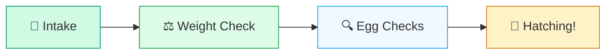
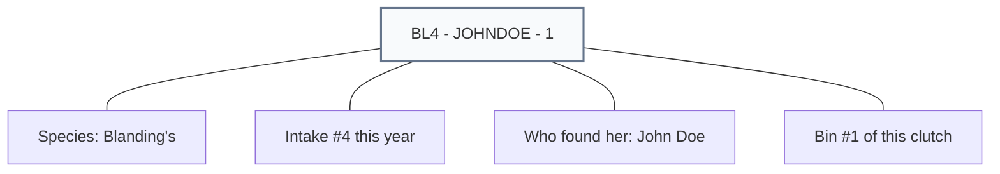
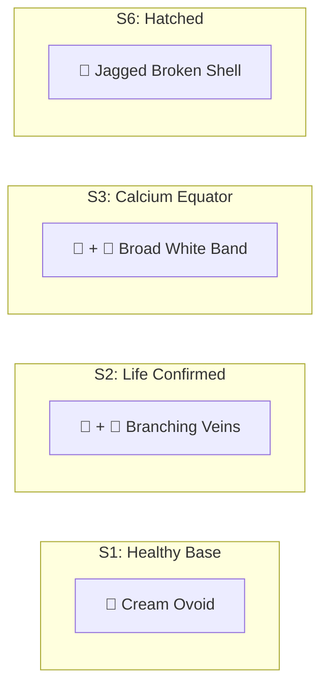

# 📖 Incubator Vault: Operator's Manual (v8.1.3)
**Clinical Sovereignty Edition (Simplicity Release)**

## 🐢 The Turtle Journey
Every egg in the Vault follows this biological path. If you follow these 4 steps, your data will always be perfect.

---

## 1. Getting Started: The Welcome Screen
When you first open the Vault, you will see the **Welcome** screen.
1.  **Select Your Name**: Choose your name from the list.
2.  **START**: Click the **START** button to begin your shift.
*   **Persistent Login**: The system will remember you for the rest of your shift.
*   **Shift Continuity**: If a co-worker was active in the last 4 hours, you will automatically join their session to keep the data consistent.

## 2. Add New Eggs (Intake)
Use the **Add New Eggs** screen when a new turtle or clutch of eggs arrives.
1.  **Step 1: Origin**: Fill in who found the turtle, the species, and the Case #.
2.  **Step 2: Sorting**: Decide how many boxes (**Bins**) you need. 
3.  **ADD**: Click **ADD** to create a new bin row.
4.  **SAVE**: Click the green **SAVE** button.

### 🧬 Anatomy of a Bin ID
The Vault automatically labels your bins with a "Smart Code." Here is how to read it:

## 3. Check on Eggs (Observations)
Select a bin from the list to start your daily checks.
1.  **Bin Weight Check**: You MUST record the current weight before checking the eggs.
2.  **START WORKING**: Click this button after entering the weight to unlock the egg grid.
3.  **Select Eggs**: Click the checkboxes for the eggs you want to update.
4.  **SAVE**: Click the green **SAVE** button at the bottom of the grid to record your observations.

## 🎨 Visual Stage Legend (Clinical Markers)
The icons in your workbench change as the turtle grows. Here is how to read the "High-Def" clinical markers:

| Icon Mark | Biological Meaning | What to do |
| :--- | :--- | :--- |
| **Cream Ovoid** | **Healthy Egg** | Standard active state. |
| **Broad White Band** | **Chalking** (Levels 1-2) | Calcium equator is visible. This indicates high vitality. |
| **Branching Veins** | **Vascularity** (+) | Red "tree" pattern visible. Heartbeat/Life confirmed. |
| **Star Crack** | **Stage S5 (Pipping)** | Multi-point crack visible. Turtle is emerging! |
| **Jagged Broken Shell** | **Stage S6 (Hatched)** | Only the "egg cup" remains. Move to transition. |
| **Grey Ovoid** | **Inactive / Retired** | Egg is no longer part of the active shift. |

### 📸 Workbench Cheat Sheet

---

## 4. 🔄 Fixing Mistakes (Correction Mode)
If you make a mistake or need to change a previous entry:
1.  Enable **Correction Mode** (requires authorized role).
2.  **REMOVE**: Use the remove buttons to undo observations.
3.  **Rollback**: If you move an egg back from "Hatched" (Stage S6) to an earlier stage, the system automatically cleans up the records.

## 5. Download Data (Reports)
Found under **Download Data**, you can export CSV or JSON files for external agency reporting (WormD).

---
*WINC Clinical Standard v8.1.3 (2026 Season)*
