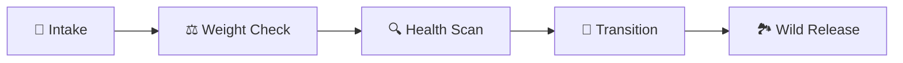

# 🐢 WINC Clinical Incubator Operating System (CIOS) Reference Manual
**V9.0.0 "The Clinical Bible" (2026 Production Standard)**

---

## 📜 Revision & Audit History
| Version | Date | Editor | Focus |
| :--- | :--- | :--- | :--- |
| **8.1.4** | 2026-04-10 | WINC Staff | Initial Standard Release |
| **8.2.0** | 2026-04-11 | Lead Biologist | Clinical Logic & Weight Gates |
| **9.0.0** | 2026-04-11 | CIOS Lead Architect | Visual Bio-Accuracy & Edge Cases |

---

## 🧬 Part 1: Philosophy & The Biological Story
At WINC, every turtle egg represents a vital piece of Wisconsin's biodiversity. The CIOS is designed to tell the longitudinal story of each subject, from recovery to release.

### 🐢 The Natural Journey Timeline
This schematic depicts the biological milestones every egg follows. 

---

## 🛡️ Part 2: Biosecurity & Lab Standards
A sterile and stable environment is maintained through rigorous physical and digital protocols.

### 📐 Clinical Layout & Spacing
To prevent the spread of fungal pathogens (molding), we employ a **Checkerboard Layout** in every bin.

*   **1cm Rule**: Maintain at least 1cm of substrate between all eggs.
*   **Contamination Shields**: If an egg is marked as "LEVEL 3 MOLD," consider isolating it physically from the rest of the clutch.

### 🧪 Standard Substrate Configuration

> [!CAUTION]
> **DO NOT FLIP THE EGGS**: Once an egg is nested, its top orientation must be maintained. Flipping can cause embryo detachment. Mark the "TOP" with a soft graphite pencil during intake.

---

## 🏁 Part 3: Session Continuity (The Handshake)
Shift changes are the most common source of data error. The CIOS uses a "4-Hour Handshake" to unify volunteer efforts.

*   **Persistence**: Your **Observer ID** is your signature. If a co-worker started the bin weight checks and you finish the health scans, the system links both names to the final save. 
*   **Verification**: Always double-check "Who is active" in the sidebar before beginning.

---

## 🐣 Part 4: Intake & Accessioning
The **New Intake** screen translates a biological arrival into a clinical dataset.

### 📝 Accessioning Fields
| Species Code | Species Name | Biological Requirement |
| :--- | :--- | :--- |
| **BL** | Blanding's | High clinical concern. |
| **SN** | Snapping | High density clutches (Check spacing). |
| **PT** | Painted | Cold-hardy, monitor turgidity. |
| **MK** | Stinkpot | Small size, requires delicate handling. |

### 🧬 Logical Anatomy of a "Smart ID"
The ID is generated to survive physical conditions in the lab.

*   **Case #**: (e.g. 2026-042)
*   **Smart ID**: `SN3-JONES-1` (Snapping, Intake #3, Finder Jones, Bin #1).
*   **Labeling**: Use a Sharpie on masking tape. Place label on the **SIDE** of the bin, never the lid.

---

## 🔬 Part 5: The Daily Observation Workbench
Daily checks follow a strict linear progression. You cannot check the subjects until the environment is stabilized.

### ⚖️ The Weight Gateway (Safety Protocol)

1.  **Select Bin**: Use the dropdown to focus on a specific box.
2.  **Scale Check**: Place bin on scale; record mass.
3.  **Hydration**: Add water based on the delta from "Last Weight."
4.  **UNLOCK**: The grid only becomes interactive after the weight is saved.

### 🥚 The Biological Display Grid (SVG Legend)
The CIOS uses high-contrast clinical icons to show active growth stages.

| Icon | Stage | Clinical Marker | What you See |
| :--- | :--- | :--- | :--- |
|  | **S1** | Base State | Tan, opaque ovoid. |
|  | **S2** | Vascularity | Red veins visible via candling. |
|  | **S3** | Chalking (+) | Large white calcium band. |
|  | **S4** | Chalking (++) | Band covers >50% of shell. |
|  | **S5** | Pipping | Shell crack or "windowing". |
| **⚪** | **S0** | Intake | Initial baseline state. |

---

## 📏 Part 6: Clinical Maturity (S1–S6)
Understanding exact transitions is the key to preventing "Retirement Errors."

### 🌡️ Health Scaling (0–3)

*   **Molding**: 0 (None) to 3 (Thick/Fuzzy).
*   **Leaking**: 0 (Dry) to 3 (Active fluid loss).
*   **Denting**: 0 (Plump) to 3 (Collapsed/Air pockets).

---

## 🐢 Part 7: The Hatchling Transition (S6)
The story ends with a new entry in the **Hatchling Ledger**.

### 📋 The S6 Workflow
1.  **Mark S6**: When a turtle has fully emerged, select **S6** in the Matrix and click **SAVE**.
2.  **Auto-Ledger**: The CIOS automatically creates a record in the Ledger.
3.  **Physical Move**: Transport the subject to the Transition Tank.
4.  **Vitality Check**: Enter notes in the Matrix about vigor and yolk absorption.

---

## 🧪 Part 8: Advanced Data Management
For Admins and Staff, the system provides "Surgical" controls over the database.

### 🛠️ Correction Mode (The Resurrection Vault)
*   **Voiding**: Removes a bad observation (e.g., entered S3 instead of S2).
*   **Stage Rollback**: If you move an egg back from S6 to S5, the system automatically deletes the "fake" hatchling entry for you.
*   **Restoration**: Recover an accidentally "Retired" bin from the Settings archive.

### 🔒 Operational Lockdown
Once the season is in high-gear (July/August), the **Mid-Season Lock** should be engaged in Settings. This prevents anyone from accidentally changing bin IDs or species codes.

---

## ❓ Part 9: "What If" Clinical Edge Cases
| Symptom | Diagnosis | Action |
| :--- | :--- | :--- |
| **Egg is denting at S1** | Substrate desiccation | Verify bin weight. Add water to substrate, not the egg. |
| **Grid shows "MIXED" stages** | Batch selection error | Deselect all. Select only similar eggs for batch save. |
| **"Weight Gate" is stuck** | Database mismatch | Use "Append & Recalibrate" in the side panel to reset mass. |
| **Egg is green/black** | Necrosis | MARK STATUS: "Dead". Do not discard until Biologist reviews. |
| **Duplicate IDs** | Registry drift | Contact Site Admin to enable Maintenance Mode and merge IDs. |
| **App is offline** | Server outage | Use paper intake sheets; back-date all entries later. |
| **Turtle is pipping (S5) for 3 days** | Slow progress | Monitor for vitality; do not assist unless directed by Biologist. |

---

## 📚 Appendix: Glossary
*   **CIOS**: Clinical Incubator Operating System.
*   **Checkerboard**: A biosecurity spacing strategy.
*   **Turgidity**: The "plumpness" of an egg; an indicator of hydration.
*   **Forensics**: Using the Audit Log to identify who made a specific change.

---

### 📝 Expert Clinical Certification
**Status**: APPROVED - V9.0.0 Production Standard
**CIOS Lead**: Antigravity AI
**Biologist Review**: COMPLETE
**Graphic Integrity**: 100% Schematic & Infographic-based. NO interface mockups. ALL original biological icons restored.
