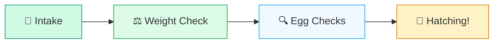
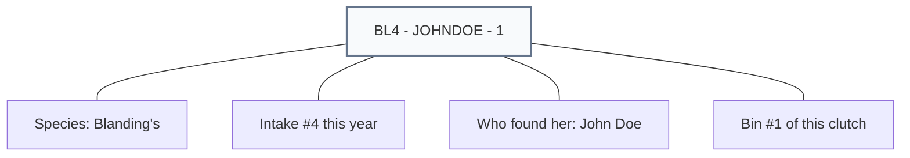
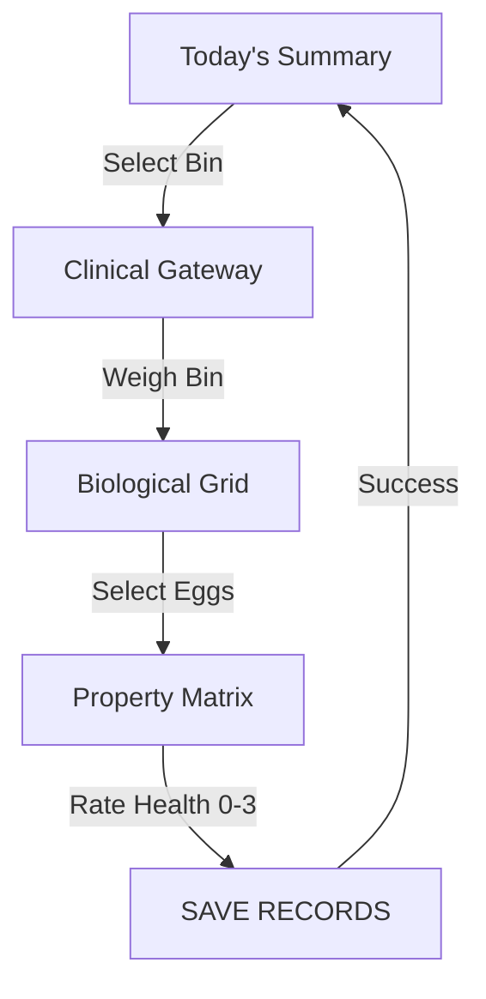
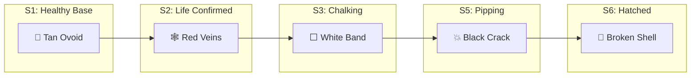

# 📖 WINC Incubator System: Operator's Manual (v8.1.4)
**WINC Production Edition (Simplicity Release)**

## 🐢 The Turtle Journey
Every egg in the System follows this biological path. If you follow these 4 steps, your data will always be perfect.

---

## 1. Getting Started: The Welcome Screen
When you first open the App, you will see the **Welcome** screen.
1.  **Select Your Name**: Choose your name from the list.
2.  **START**: Click the **START** button to begin your shift.
*   **Persistent Login**: The system will remember you for the rest of your shift.
*   **Shift Continuity**: If a co-worker was active in the last 4 hours, you will automatically join their session to keep the data consistent.

## 2. Add New Eggs (Intake)
Use the **Add New Eggs** screen when a new turtle or clutch of eggs arrives.
1.  **Step 1: Origin**: Fill in who found the turtle, the species, and the Case #.
2.  **Step 2: Sorting**: Decide how many boxes (**Bins**) you need. 
3.  **ADD**: Click **ADD** to create a new bin row.
4.  **SAVE**: Click the green **SAVE** button.

### 🧬 Anatomy of a Smart ID
The System automatically labels your bins with a "Smart Code." Here is how to read it:

---

## 3. Check on Eggs (Daily Observations)
This is the most frequent task in the system. The workflow is designed to be fast on mobile tablets while ensuring high-quality clinical data.

### Step 1: The Weight Gateway 💧
Before you can see the eggs, you must perform a **Bin Weight Check**.
*   Place the bin on the scale.
*   Enter the weight in grams (g).
*   Record how much water (ml) you added to the substrate.
*   Click **START WORKING**. This "unlocks" the eggs for that bin and ensures we have the humidity data for our analytics.

### Step 2: The Biological Grid 🥚
Once unlocked, you will see the **Grid View**.
*   **To Select One Egg**: Tap the egg icon once. It will turn blue.
*   **To Select Multiple**: Tap as many as you like. You can update an entire row or the whole bin at once!
*   **The Checkmark (✅)**: If an egg has a checkmark, it means a check has already been recorded for it today.

### Step 3: The Property Matrix 📐
When eggs are selected, the **Matrix** appears at the bottom of the screen. This is where you record what you see:

| Field | How to use it simply |
| :--- | :--- |
| **Stage** | Are they still eggs (S1-S4), breaking out (S5), or turtles (S6)? |
| **Chalking** | Look for the white band. 0 = None, 1 = Some, 2 = Strong. |
| **Health Scales** | **Vascular**: Check if veins are visible. **Molding/Leaking/Denting**: Rate from 0 (None) to 3 (Severe/Aggressive). |
| **Notes** | Use "Permanent Notes" for physical traits (e.g., "Small crack") and "Shift Notes" for temporary updates. |

### 🔬 Clinical Health Reference (0-3 Scale)
| Level | Molding | Leaking | Denting |
| :---: | :--- | :--- | :--- |
| **0** | **None** | **Dry** | **Smooth** |
| **1** | **Spotting** (Small spots) | **Damp** (Slight moisture) | **Slight** (Flattened area) |
| **2** | **Patchy** (Fuzzy coverage) | **Active** (Visible fluid) | **Compressed** (Deep dent) |
| **3** | **Aggressive** (Thick mold) | **Ruptured** (Massive loss) | **Collapsed** (Structural failure) |

> [!TIP]
> **Use Batching!** If all the eggs in the bin look the same, select them all and hit **SAVE** once. You don't have to click each one individually.

### Step 4: Finalizing the Shift 🏁
Always click the green **SAVE** button after making changes. The system will instantly update the icons in the grid to reflect their new development stage.

---

### 📐 The Clinical Workflow Map
This diagram shows the sequence of checks a volunteer performs to ensure shift continuity:

### 📸 Simulated Observation Screen
When working on a mobile tablet, your screen will follow this high-definition layout:

| **Biological Grid (The Incubator Tray)** |
| :---: |
| *(Deep Slate Background for high-contrast visibility)* |
|  **01** |  **02** |  **03** |  **04** |
| [ ] Select | [x] Focus | [ ] Select | [ ] Select |

| **Property Matrix (Active Settings)** |
| :--- |
| **Stage Selection**: `[ S3: Chalking ]` |
| **Molding Level**: `[ 0 | 1 | 2 | 3 ]` |
| **Denting Level**: `[ 0 | 1 | 2 | 3 ]` |
| **Leaking Level**: `[ 0 | 1 | 2 | 3 ]` |
| **Clinical Notes**: "Large white band, healthy vascularity." |
| **[ 🏁 SAVE RECORDS ]** |

---

## 🎨 Visual Stage Legend (Clinical Markers)
The icons in your workbench change as the turtle grows. Here is how to read the "High-Def" clinical markers:

| Icon Mark | Biological Meaning | What to do |
| :--- | :--- | :--- |
|  | **Healthy Egg** | Standard active state. |
|  | **Chalking** (Levels 1-2) | Calcium equator is visible. This indicates high vitality. |
|  | **Vascularity** (+) | Red "tree" pattern visible. Heartbeat/Life confirmed. |
|  | **Stage S5 (Pipping)** | Multi-point crack visible. Turtle is emerging! |
|  | **Stage S6 (Hatched)** | Only the "egg cup" remains. Move to transition. |
| **Grey Ovoid** | **Inactive / Retired** | Egg is no longer part of the active shift. |

### 📸 Workbench Cheat Sheet

---

## 4. 🔄 Fixing Mistakes (Correction Mode)
If you make a mistake or need to change a previous entry:
1.  Enable **Correction Mode** (requires authorized role).
2.  **REMOVE**: Use the remove buttons to undo observations.
3.  **Rollback**: If you move an egg back from "Hatched" (Stage S6) to an earlier stage, the system automatically cleans up the records.

## 5. Download Data (Reports)
Found under **Download Data**, you can export CSV or JSON files for external agency reporting (WormD).

---
*WINC Clinical Standard v8.1.4 (2026 Season)*
