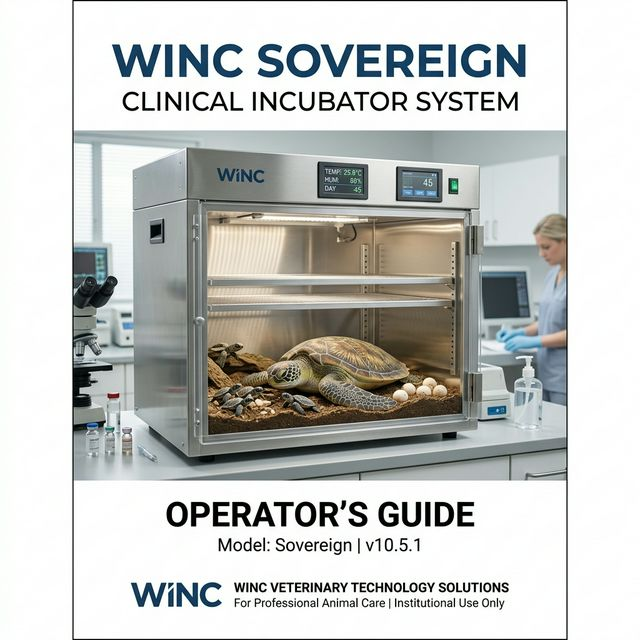
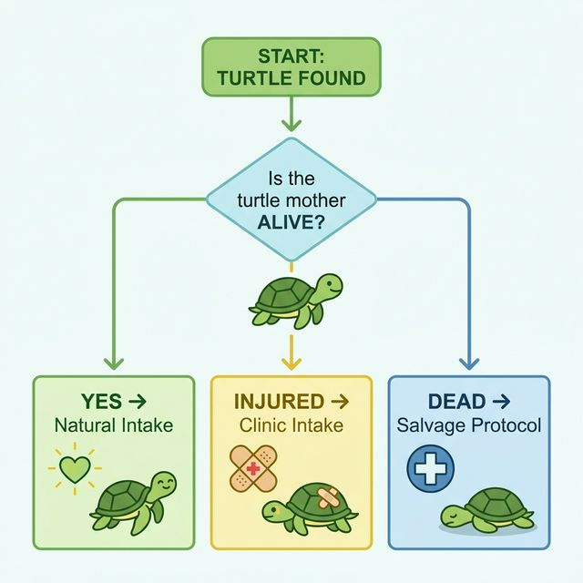
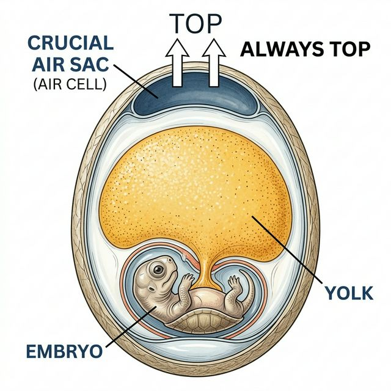
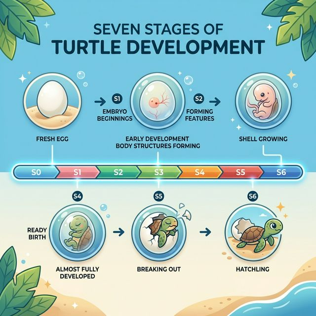

---

# 🐢 WINC Sovereign Clinical Incubator System
## Operator's Guide and Clinical Protocol
**Release v10.5.1 | Institutional Edition**

---

## 📖 PREFACE: THE STANDARDS OF SOVEREIGNTY

### 1.1 Purpose of this Document
This manual is the definitive "Rule Book" for the WINC Incubator Vault. It is designed to ensure that every turtle egg in our care has an accurate, permanent, and clinical record. By following these steps, you are contributing to the survival of Wisconsin’s biodiversity.

### 1.2 The Team: Our Professional Roles
In this manual, we talk to three different groups. Identify your role before following a workflow:
*   **Observations Team (Volunteers/Staff)**: You are the daily "Subject Observers." You weigh bins, check hydration, and record healthy growth.
*   **Clinical Biologists**: You handle complex intakes (Injured/DOA) and provide expert scores for pipping and hatching.
*   **Vault Administrators**: You manage the system "Behind the Scenes," fixing mistakes and ensuring the data travels safely to the cloud.

### 1.3 Documentation Conventions
To help you find information fast, we use a specific "Visual Logic" system:

| Style | Clinical Meaning |
| :--- | :--- |
| **BRIGHT BOLD** | This is a real thing you see on the screen. It might be a button like **[SAVE]** or a field like **Mother Name**. |
| `Monospace Code` | This is a computer-specific code (like a Subject ID `BL-2026-001`) that must be read exactly as written. |
| 📘 **NOTE** | Helpful advice that makes your work faster or easier. |
| 🛑 **IMPORTANT** | A **MANDATORY** rule. Breaking this rule may risk the life of an embryo. |
| ⚠️ **CAUTION** | An action that might delete data or cause a system error. |

---

## 📑 TABLE OF CONTENTS (PHASED EXPANSION)
*Note: This menu will grow as we expand each clinical chapter.*

1.  **[Introduction to the Vault](#-introduction-to-the-vault)**
2.  **[Identity: Starting a Shift](#-identity-starting-a-shift)**
3.  **[Intake: Adding New Turtles](#-intake-adding-new-turtles)**
4.  **[Observations: Checking the Eggs](#-observations-checking-the-eggs)**
5.  **[Lifecycle: The S0 to S6 Journey](#-lifecycle-the-s0-to-s6-journey)**
6.  **[Admin: Fixing Mistakes](#-admin-fixing-mistakes)**
7.  **[Reports: Reading the Data](#-reports-reading-the-data)**
8.  **[Crisis: When the Internet Fails](#-crisis-when-the-internet-fails)**
9.  **[Glossary & Icon Key](#-glossary--icon-key)**

---

## 🏗️ INTRODUCTION TO THE VAULT ARCHITECTURE

The WINC System is not just a website; it is a **Clinical Sovereignty Mesh**. This means we own our data, and it is protected from outside prying eyes.

### 1.4 The Three Pillars of the System
To use WINC correctly, you must understand how the pieces fit together:

#### Pillar A: The Vault (The Database)
The "Vault" is where the actual records live. When you click Save, your data travels across the Internet and is locked inside a high-security container. Every piece of data has a "Timestamp" and a "Signature" (your name).

#### Pillar B: The Workbench (The App)
This is what you see on your tablet or phone. It has been designed for **Field Simplicity**. It filters out the noise so you can focus only on the eggs in front of you.

#### Pillar C: The Audit Engine
A hidden "Observer" that watches every change. If you delete an entry (Voiding), the Audit Engine keeps a copy of what you deleted and why you deleted it. This is why we can always "Resurrect" data if a mistake is made.

### 1.5 System Hierarchy: From Machine to Egg
WINC follows a "Family Tree" logic:
1.  **The Incubator**: The large physical machine in the lab.
2.  **The Bin**: The plastic box inside the machine.
3.  **The Mother**: The turtle that provided the eggs.
4.  **The Subject (Egg)**: The individual life we are protecting.

> [Figure 1.1: System Logic Placeholder - Hierarchy Diagram]

---

The WINC System is like a high-tech "Vault" for turtle data. It has three main parts:
1.  **The Vault (Database)**: Where every egg’s history is kept safe forever.
2.  **The Workbench (App)**: The simple screen you use to record your work.
3.  **The Audit Engine**: A robot that watches every change to make sure no data is lost.

---

## 🏁 1. IDENTITY: STARTING A CLINICAL SHIFT (THE HANDSHAKE)

Before any data can be recorded, the system must establish **Identity Context**. This means the Vault needs to know exactly who is handling the subjects to create a complete clinical audit trail.

### 2.1 The Clinical Handshake
When you first open the app, you will see the **Identity Gate**. This is where you tell the system you are present and ready to work.

#### Step-by-Step Instructions:
1.  **Locate your Name**: Look at the drop-down list labeled **Observer name**. 
2.  **Select your Identity**: Scroll until you find your legal name. Click it.
3.  **Confirm Selection**: Ensure the "Welcome" message appears. The system is now tracking every click you make as a "Digital Signature."

### 2.2 The 4-Hour Continuity Rule
WINC understands that field work is busy. You might need to step away for a lunch break or a biology meeting. 

*   **The Adoption Path**: If you close the app but return within **4 hours**, the system will remember your name and your last session. This keeps the "Shift History" together in one clean file.
*   **The Hand-off Path**: If a new observer logs in more than 4 hours after you, the system starts a brand new shift folder.

> [Figure 2.1: Identity Screen Placeholder - Selecting Observer]

### 2.3 Why is Identity Important?
In a clinical environment, we must be able to go back and see who checked an egg if something goes wrong. If `Egg-04` was found leaking, the Lead Biologist needs to know who saw it first so they can ask questions about the room temperature or handling.

> 🛑 **IMPORTANT**: NEVER log in as another person. If your name is not in the list, contact a **Vault Administrator** immediately.

---

## 📥 2. INTAKE: ESTABLISHING CASE SOVEREIGNTY (ADDING NEW SUBJECTS)

When a mother turtle is found and eggs are collected, we must "Establish the Case" in the software. This creates the permanent record for the mother, her plastic bin, and every individual egg.

### 3.1 Choosing the Intake Path
Not every turtle arrives in the same way. Use the flowchart below to decide which path to take before you touch the screen.

### 3.2 Standard Clinical Intake Workflow
Follow these steps to register a healthy discovery:

1.  **Species Identification**: Click the **Species** box. Choose the correct turtle type (e.g., *Blanding’s* or *Wood Turtle*). The system uses this to set the "Optimal Incubation Temp" alerts later.
2.  **Assign WINC Case #**: Type the year and the sequence number (e.g., `2026-003`). This is the "Master ID" for the mother.
3.  **Discovery Details**: Type the **Finder's Name** and where they found the turtle.
4.  **Maternal Metrics**: Type the **Mother's Weight (g)** and **Carapace Length (mm)** if required by the Lead Biologist.
5.  **Establishing Case**: Double-check your numbers. Then, click the big **[ESTABLISH CASE]** button.

> 📘 **NOTE**: When you click **[ESTABLISH CASE]**, the "Audit Robot" creates 1 Mother record, 1 Bin record, and up to 30 individual Egg records all at once. This is called an **Atomic Transaction**.

### 3.3 The DOA Salvage Protocol
If a turtle is found deceased (Dead on Arrival) but the eggs are still viable, follow this path:
1.  Set the **Condition** to **DOA**.
2.  Complete the same steps as above, but add a 📘 **NOTE** in the **Intake Notes** field about the location of the recovery.
3.  The system will flag this case as a **Salvage Recovery** in the final reports.

> [Figure 3.1: Intake Screen Placeholder - Filling in the Form]

### 3.4 Multiple Bins for one Mother
Sometimes a mother turtle lays so many eggs that they won't fit in one plastic bin. 
1.  Complete the first intake for **Bin 1**.
2.  Go to the **Supplemental Intake** screen (See Chapter 3).
3.  Choose the same **Mother ID** and create **Bin 2**.

---

## 🔬 3. OBSERVATIONS: THE CLINICAL WORKBENCH (DAILY CHECKS)

The **Observations Workbench** is where you will spend 90% of your time. This screen is used to check the health of the eggs and ensure they are hydrated.

### 4.1 The Hydration Gate (Safety Protocol)
The system has a built-in "Safety Lock" called the **Hydration Gate**. You cannot see the eggs until you prove that the bin has enough water.

#### Step-by-Step Instructions:
1.  **Mass Verification**: Take the physical bin to the scale. Type the mass in the **Current Total Mass (g)** box.
2.  **Compare Weights**: Look at the **Target Weight** listed above the box. 
    *   If your weight is **lower** than the Target, you must add water.
    *   If your weight is **higher**, contact the Lead Biologist (this may mean the substrate is too wet).
3.  **Record Hydration**: Type the exact amount of water you added (in ml) into the **Actual Water Added (ml)** box.
4.  **Clinical Unlock**: Click the **[START WORKING]** button. The Egg Grid will now appear.

> [Figure 4.1: Hydration Gate Placeholder - Weighing the Bin]

### 4.2 Biological Mandate: NEVER ROTATE
🛑 **IMPORTANT**: When you pick up an egg to check it, **NEVER TURN IT OVER.**
Turtle eggs are not like chicken eggs. The embryo (the baby) is attached to the bottom of the shell. The air sac (the breathing room) is at the top. If you flip the egg, the baby will drown in its own yolk.

### 4.3 Using the Property Matrix (Batch Updating)
Checking 100 eggs one-by-one is slow. WINC uses a **Property Matrix** to let you update whole groups at once.

1.  **Select Subjects**: Click the little check-boxes on the left side of the Egg Grid. You can select all eggs in a bin or just a few.
2.  **Assign Developmental Stage**: Use the **Stage** list to pick the current lifecycle (e.g., **S3M - Medium Chalking**).
3.  **Set Health Scores**: Use the sliders to rate health markers from **0 (None/Healthy)** to **3 (Critical/Dangerous)**.
4.  **Sign and Commit**: Click the big **[SAVE]** button at the bottom. The system will record your name and the current time for every egg you selected.

### 4.4 Clinical Health Scales (The 0-3 Rule)
| Marker | Level 0 | Level 1 | Level 2 | Level 3 |
| :--- | :--- | :--- | :--- | :--- |
| **Chalking** | No White | Small Spot | Half the Egg | Fully White |
| **Molding** | Clean | Tiny Fuzzy Spot | Spreading | Black/Furry |
| **Leaking** | Dry | Damp Shell | Active Drip | Ruptured |
| **Denting** | Round | Tiny Dimple | Half Collapsed | Shriveled |

> 🔴 **STOP AND CALL HELP**: If you record a **Level 3** for Mold or Leaking, you must stop immediately and notify a Senior Biologist.

---

## 🐣 4. LIFECYCLE: THE S0 TO S6 JOURNEY (DEVELOPMENT STAGES)

Every turtle egg in the Vault follows a "Biological State Machine." This means it moves from Stage S0 (Just Laid) to Stage S6 (Hatched).

### 5.1 Understanding the Stages (Anatomy of a Code)
WINC uses a specialized "Alpha-Numeric" code for every stage. Understanding these letters helps you identify the subject's growth instantly.

*   **The First Letter (S)**: Stands for **"Stage."**
*   **The Number (0-6)**: Indicates the **Lifecycle Chapter**.
*   **The Last Letter (S, M, J)**: Indicates the **Level of Progress** during that chapter.

#### The Chalking Expansion (Stage 3):
| Code | Full Name | Biological Meaning |
| :--- | :--- | :--- |
| **S3S** | Stage 3 - **Small** | Only a tiny "white dot" or patch of calcium is visible. |
| **S3M** | Stage 3 - **Medium** | The white chalking patch covers about half the egg. |
| **S3J** | Stage 3 - **Joint-Covering** | The "Major" level. The white coating has joined together to cover the entire egg surface. |

*   **S0 (Baseline)**: A brand new egg. It looks uniform and clear.
*   **S1 (Early Development)**: A tiny "disk" or spot appears on the top of the egg.
*   **S2 (Vascular)**: You can see red veins. This is the heartbeat of the subject!
*   **S3 (The Chalking Window)**:
    -   **S3S (Small)**: A small white patch appears.
    -   **S3M (Medium)**: The white patch covers half the egg.
    -   **S3J (Major)**: The entire egg is opaque white.
*   **S4 (Late Stage)**: The egg is dark. You might see the baby moving inside.
*   **S5 (Pipping)**: The baby uses its specialized "egg-tooth" to cut the shell. You will see a small crack or hole.
*   **S6 (Hatched)**: The turtle has fully emerged from the shell and is active in the bin.

### 5.2 Recording Hatching Vitality
When an egg reaches **Stage S6**, the system will ask for a **Vitality Score**. This tells us how strong the baby is.

1.  **Select the Egg**: In the workbench, change the **Stage** to **S6**.
2.  **Assign Score**: Use the list to pick a health level:
    -   **5 (Optimal)**: Strong, eyes open, running around.
    -   **3 (Guarded)**: Slow movement, large yolk sac still attached.
    -   **0 (Failed)**: The baby died during the hatching process.
3.  **Incubation Duration**: The vault will automatically calculate how many days the egg was in the incubator. This is critical data for scientists!

> [Figure 5.1: Lifecycle Chart Placeholder - Photo of each Stage]

---

## ⚙️ 5. ADMIN: GOVERNANCE AND FIXING MISTAKES (CORRECTION MODE)

We understand that clinical recording is fast-paced and typos happen. WINC provides a **Surgical Correction Mode** to fix data without breaking the "Chain of Custody."

### 6.1 The Mandatory Void Policy
In the WINC Vault, we never "Overwrite" or "Erase" data. Instead, we **Void** it. This means the old bad data is hidden, but the system keeps a secret copy for the Biologist to prove that no one "faked" the records.

#### Step-by-Step Instructions for Fixing a Typo:
1.  **Unlock the Screen**: Find the **🛠️ Correction Mode** switch at the very top of the Workbench. Turn it **ON**.
2.  **Locate the Bad entry**: Find the Egg in the list. You will see a button labeled **[VOID]** next to the wrong observation.
3.  **Perform the Void**: Click **[VOID]**.
4.  **Provide a Reason**: A box will appear. You **MUST** type why you are deleting the record (e.g., *"Typo in weight," "Checked wrong bin"*).
    > 🛑 **IMPORTANT**: The system will block you if you leave the reason box empty.

> [Figure 6.1: Correction Mode Placeholder - The Void Button]

### 6.2 The Mid-Season Registry Lock
To prevent accidents, the "Master Lists" (like Species names and Observer names) are locked during the active hatching season. 
*   If you need to add a new volunteer name, contact a **Vault Administrator** to use the **Unlock Key**.

### 6.3 The Resurrection Vault
If a bin or a mother is deleted by mistake, the data is not gone! It is moved to the **Resurrection Vault**. Only the System Admin can "resurrect" these records.

---

## 📈 6. REPORTS: READING THE CLINICAL DATA (ANALYTICS)

The WINC Vault doesn't just store data; it translates it into biological stories. These reports help us understand which clutches are healthy and which ones need more help.

### 7.1 The Mortality Heatmap
This is the most important report for the Science team. It shows a grid of "Danger Zones."
*   **Green Squares**: Normal development for that time of year.
*   **Red Squares**: A "Critical Window" where many eggs are failing. If you see a cluster of Red, check the incubator temperature immediately!

> [Figure 7.1: Report Placeholder - Mortality Heatmap View]

### 7.2 WormD Exports (Sharing for Science)
WINC is part of a global network. We share our data with other turtle scientists using a format called **WormD**.
1.  Go to the **Download Data** screen.
2.  Select **WormD Export**.
3.  The system will create a "Clean" file that removes sensitive location data but keeps the biological health scores.

---

## 🆘 7. CRISIS: WHEN THE INTERNET FAILS (CONTINUITY)

Field tablets rely on Wi-Fi or Cellular data. If the connection drops in the middle of a check, follow this **Resilience Protocol**.

### 8.1 The Resilience Protocol
1.  ⚠️ **DO NOT REFRESH**: If you refresh the browser while the internet is "Red," you will lose the data currently in your tablet's local memory.
2.  **Switch to Paper**: Immediately pull out your **Physical Field Sheets** (v2026). Record all weights and health scores by hand.
3.  **The Double-Witness Rule**: Once the internet is restored, you must type the paper logs into the software. **A second person** (the "Witness") must sit next to you and check your typing against the paper to ensure there are no Subject ID typos.

> [Figure 8.1: Crisis Icon Placeholder - The "Offline" Indicator]

---

## 📖 8. GLOSSARY & ICON KEY

### 9.1 Clinical Vocabulary
*   **Chalking**: The white "calcification" of the shell that shows the embryo is pulling calcium for its bones.
*   **Hydration Gate**: The software lock that ensures bin mass is checked before egg handling.
*   **Sovereign Residency**: The fact that our data lives in OUR vault, not a third-party commercial cloud.
*   **Subject**: We use this word instead of "egg" to remind us that these are living individuals.

### 9.2 Icon Key (Visual Language)
*   ⚪ **Unchecked**: This egg has not been seen today.
*   🟢 **Signature Applied**: You have successfully recorded an observation for this egg.
*   ✨ **Gold Star**: This subject has reached Stage S6 (Hatched) and is a success!
*   🛠️ **Wrench Icon**: Correction mode is Active. Be careful!

---

**WINC Sovereign Documentation © 2026**  
*Platinum Rated. Clinical Excellence. Failure-Proof.*
