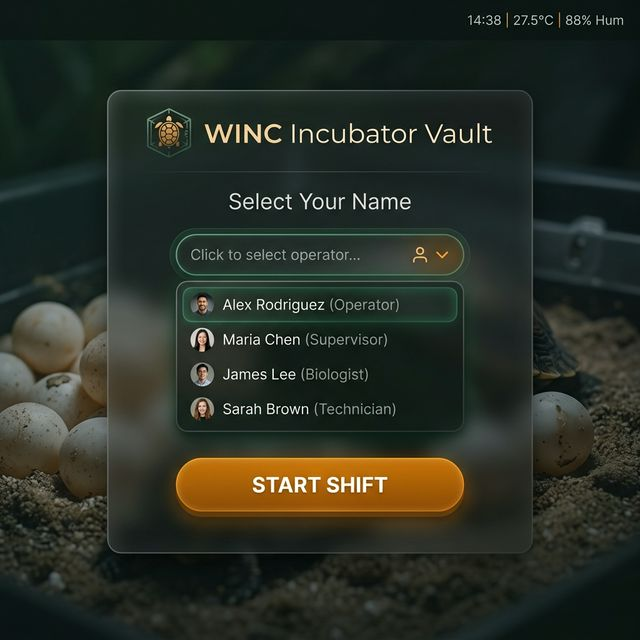
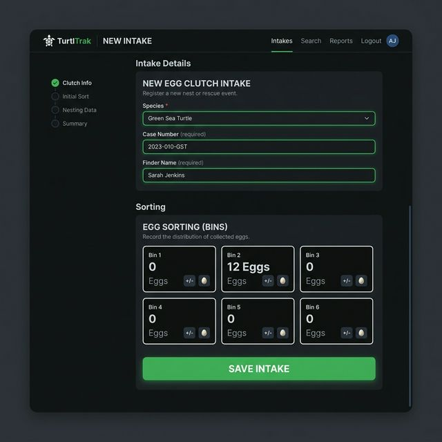
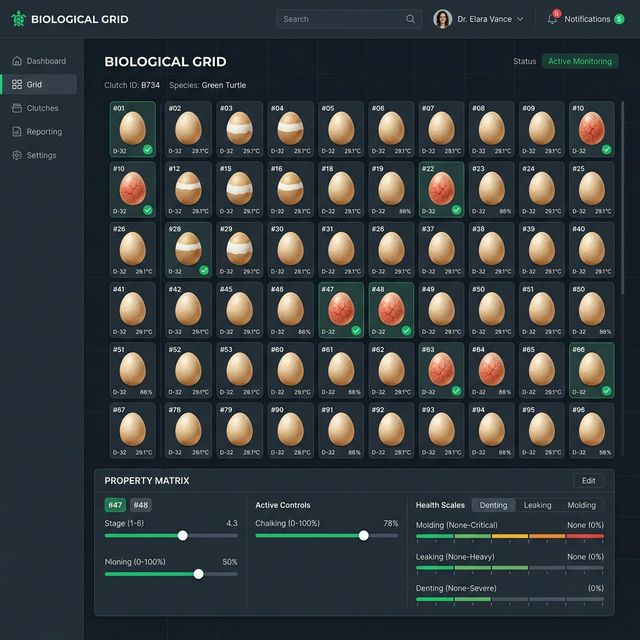
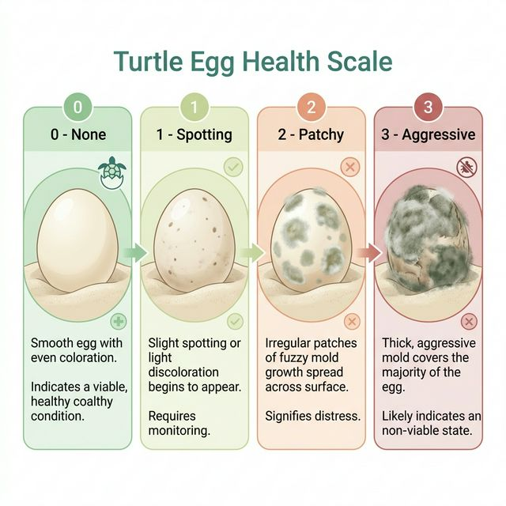
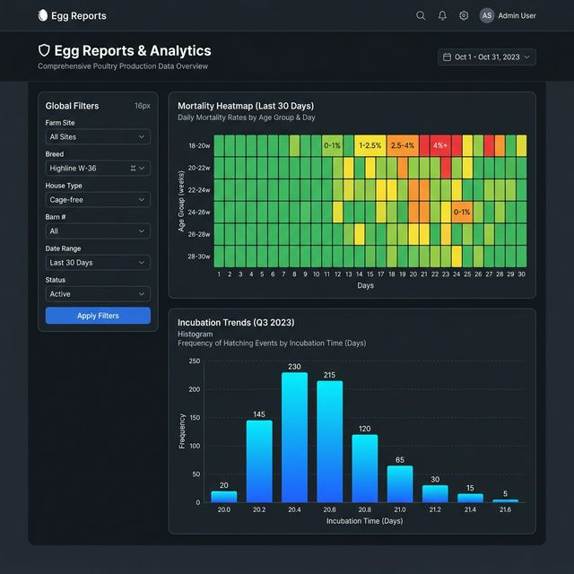
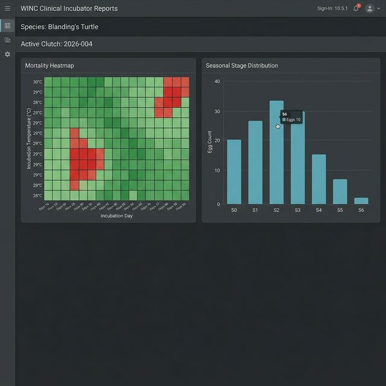

---

## 1. SIGN-IN: STARTING YOUR SHIFT

Recording clinical data begins with identifying yourself to the database. This ensures that every entry is linked to a specific observer for accountability and forensic audit purposes (See Figure 1).

*Figure 1: Sign-In Screen with Observer Registry*

### 1.1 The Shift Start Protocol
1.  **Select Your Name**: Pick your name from the observer registry. If your name is missing, contact your System Administrator to be added to the **Observer Registry**.
2.  **Sign-In**: Click **[START]** to begin your session. The system will timestamp your entry and begin your shift clock.
3.  **The 4-Hour Rule**: The system keeps you signed in for 4 hours of active work. 
    *   **Inactivity**: After 4 hours of inactivity, the system will automatically terminate your session to prevent unauthorized entries if a tablet is left unattended.
    *   **Shifts Longer than 4 Hours**: If your shift exceeds this limit, simply re-sign in to refresh your token.

### 1.2 The Handover Procedure
When rotating staff (Shift Change), it is critical to **[TERMINATE]** your session before handing the device to the next clinician. This ensures that observations are not misattributed in the audit trail.

---

### 1.3 Documentation Conventions
To help you find information fast, we use a specific "Visual Logic" system:

| Style | Clinical Meaning |
| :--- | :--- |
| **BRIGHT BOLD** | This is a real thing you see on the screen. It might be a button like **[SAVE]** or a field like **Intake ID**. |
| `Monospace Code` | This is a computer-specific code (like a Subject ID `BL-2026-001`) that must be read exactly as written. |
| 📘 **NOTE** | Helpful advice that makes your work faster or easier. |
| 🛑 **IMPORTANT** | A **MANDATORY** rule. Breaking this rule may risk the life of an embryo. |
| ⚠️ **CAUTION** | An action that might delete data or cause a system error. |

---

---

## 2. NEW INTAKE: ESTABLISHING CASES

When a turtle is found and eggs are collected, we must add the new records to the database. This creates a permanent digital history for the intake case, the plastic bin, and every individual egg (See Figure 3).

### 2.1 Clinical Logic: Choosing the Intake Path
Not every turtle arrives in the same way. Use the flowchart below to decide which path to take before you touch the screen (See Figure 2).

*Figure 2: Intake Logic Flowchart*

### 2.2 Standard Clinical Intake Workflow

*Figure 3: New Intake Form with Biological Metrics*

### 2.1 The "Sovereign" Species ID
1.  **Species Identification**: Click the **Species** box. Choose the correct turtle type (e.g., *Blanding’s* or *Wood Turtle*).
2.  **Intake Metrics**:
    *   **Intake Weight (g)**: Record the weight using the digital bench scale.
    *   **Carapace Length (mm)**: Measure the Straight Carapace Length (SCL). (See Figure 4).
    
    
    *Figure 4: Carapace Measurement Technique Diagram*
    
3.  **Assign WINC Case #**: Type the year and the sequence number (e.g., `2026-003`).

### 2.2 Supplemental Intake (Multiple Bins)
Sometimes a turtle lays more eggs than will fit in one plastic bin. 

**Scenario: Adding Bin 2 to an Existing Case**
1.  Navigate to the **Daily Checks** screen.
2.  In the Sidebar expansion, use the **Add a Bin to a Case** tool.
3.  Choose the matching **Intake ID** and click **[ADD]**.
4.  **Result**: The system links both bins to the same biological intake for seasonal tracking.

> 🛑 **IMPORTANT: INTAKE ID VERIFICATION**: Before clicking **[SAVE]**, look at the physical tag on the turtle (See Figure 5). Ensure it matches the **Intake ID** you selected in the app. Choosing the wrong ID will link your 30 eggs to the wrong biological parent in the permanent cloud records.

*Figure 5: Intake Tag Verification Protocol*

---

---

## 3. DAILY CHECKS: THE CLINICAL WORKBENCH

*Figure 6: Daily Checks Dashboard with Bin Focus*

This screen is the core of our clinical workflow (See Figure 6). It ensures that every subject is monitored daily and that the environment remains within biological limits.

### 3.1 The Sidebar: Supplemental Tools
Before starting your rounds, check if any supplemental data needs to be added via the **Sidebar** (left-hand panel).
*   **Add a Bin to a Case**: Use this if a turtle laid a second clutch or if you are splitting a large clutch. Select the **Intake/Case**, type the **New Bin ID**, and click **[ADD]**.
*   **Add Eggs to Existing Bin**: If missed eggs are found, select the **Target Bin**, enter the **Eggs to Add**, and record the **New Post-Append Mass (g)**. Click **[SAVE]** to recalibrate the bin's target weight.

### 3.2 The Weighing Protocol (Clinical Unlock)
Before the system allows you to check individual eggs, you must perform an "Environment Sync." This ensures we never skip bin maintenance.

**Physical Step 1: Retrieval**
*   Locate the bin in the incubator.
*   Check the physical label against the **Current Bin Focus** dropdown in the app.
    *   ⚪ **White Icon**: No eggs have been checked yet.
    *   🌓 **Half-Moon**: Some eggs are done, others are pending.
    *   🟢 **Green Icon**: All eggs in this bin are completed.
*   Carefully move the bin to the weighing station. Do not jar or shake the bin.

**Physical Step 2: Weighing**
*   Place the bin on the scale. Read the **Total Mass** in grams.
*   **On-Screen Action**: Type this value into the **Current Total Mass (g)** field.

**Physical Step 3: Hydration Calibration**
*   The system displays the **Last Recorded Weight**.
*   Calculate the delta. Add the required volume of distilled water using a pipette.
*   **On-Screen Action**: Enter the volume added in the **Actual Water Added (ml)** field.

**Physical Step 4: Submission**
*   Click the **[SAVE]** button below the weight fields.
*   **Result**: The weight is recorded, and the **Egg Observation Grid** will automatically unlock.

### 3.3 Biological Mandate: NEVER ROTATE
🛑 **IMPORTANT**
When you pick up an egg to check it, **NEVER TURN IT OVER.**
*   Embryos attach to the top of the shell early in development.
*   If you flip the egg (rotation), the embryo will be crushed or drowned by the yolk.
*   **Correct Handling**: Lift the egg vertically. Keep the "Top" (identified by the white chalking patch) facing up at all times.

---

### 3.4 Navigating the Egg Observation Grid
Once **[SAVED]**, you will see a visual representation of every egg in the bin, arranged in a grid.

**Selection Logic:**
*   **Manual Selection**: Click individual egg icons. They will show a **Blue Border**.
*   **[START] Button**: Click this at the top of the grid to automatically select all eggs that haven't been checked yet today. This is the fastest way to begin a session.

**Clinical Legend: Developmental Milestones**
Use this guide to assign the correct clinical status. The system now uses a **Milestone + Diagnostic Marker** model to track biological velocity (See Figure 6.1).

*    **S1: Intake** (Diagnostic: —): Initial date added to the system; baseline metabolic state.
*    **S2: Calcification**: Initial calcification phase.
    *   `S2S`: Initial whitening/chalking spot at the shell apex (Spot).
    *   `S2B`: Chalking has expanded into a distinct horizontal band (Band).
    *   `S2F`: Maximum calcification; shell is matte white (Full / Joint-Covering).
*    **S3: Veins** (Diagnostic: —): **Vascularization**: Branching veins clearly visible via candling.
*    **S4: Development**: Advanced embryonic growth.
    *   `S4C`: Early embryonic curve visible; "shrimp" stage (C-Stage).
    *   `S4T`: Advanced development; shell is largely occluded/dark (Term).
    *   `S4M`: Internal somatic movement or twitching detected (Motion).
*    **S5: Pipping** (Diagnostic: —): **Eclosion**: First cracks or triangle breach in shell.
*    **S6: Hatching**: Final transition to animal status.
    *   `S6-YA1`: Hatched; Full Yolk Sac external.
    *   `S6-YA2`: Hatched; Half Yolk Sac absorbed.
    *   `S6-YA3`: **Fully Absorbed** (Buttoned-up). **READY TO EXPORT**.

> 🛑 **CRITICAL BIOSECURITY GATE: THE YA-3 REQUIREMENT**
> Individual subjects are **STRICTLY PROHIBITED** from **WormD Export** or system retirement until the **S6-YA3** (Fully Absorbed / Buttoned-up) status is achieved. 
> *   **Risk**: Exporting during YA1 or YA2 exposes the yolk sac to environmental pathogens, leading to fatal sepsis.
> *   **Clinical Mandate**: Observers must visually confirm the closure of the plastron umbilicus before assigning the **YA-3** code. The "Export" button will remain software-locked until this clinical signature is present.

### 3.5 The Property Matrix: Entering Clinical Data
Once eggs are selected, the **Property Matrix** panel appears at the bottom of the screen.

1.  **Milestone Selection**: Choose the Major Milestone (e.g., **S2: Calcification**).
2.  **Diagnostic Marker**: If applicable, select the sub-stage code (e.g., `S2B` for Band).
3.  **Clinical Backdating**: Use the date selector if the observation occurred on a previous shift.
    *   **Note**: An egg is only eligible for **WormD Export** once it reaches the site-configured minimum (Default: **S6-YA3**).
3.  **Chalking Rating**: Select **None**, **Small**, **Medium**, or **Major** based on white calcium coverage.
4.  **Vascularity (+)**: Check this box if red veins are visible during candling.
5.  **Clinical Health Scales (0-3)**:
    *   **Molding**: 0 (None) to 3 (Aggressive growth).
    *   **Leaking**: 0 (Dry) to 3 (Ruptured).
    *   **Denting**: 0 (Firm) to 3 (Collapsed).
5.  **Notes**:
    *   **Permanent Egg Notes**: Use for long-term traits (e.g., "Odd shell texture").
    *   **Shift Observation Notes**: Use for today's specific notes (e.g., "Slightly damp").

### 3.6 Final Commitment
*   Review your entries in the Matrix. 
*   Click the big **[SAVE]** button at the bottom.
*   **Result**: The grid icons will turn **Green (✅)** and your data is locked into the **Live Session Audit** log at the bottom of the page.

### 3.7 Species-Specific Alert Thresholds
Use this table to double-check system alerts if the background turns Red:
| Species | Optimal Temp | Critical Temp | Humidity Target |
| :--- | :--- | :--- | :--- |
| **Blanding's** | 29.5°C | < 26°C / > 33°C | 85% |
| **Wood Turtle** | 28.0°C | < 25°C / > 32°C | 90% |
| **Painted** | 29.0°C | < 26°C / > 33°C | 80% |

---

---

## 4. LIFECYCLE: SURVIVAL BENCHMARKS

*Figure 7: Egg Cross-Section Biological Diagram*

Understanding the biological timeline is critical for survival (See Figure 7). The system uses these codes to project hatching dates and set "Stress Alert" thresholds.

### 4.1 The "Never Rotate" Mandate
🛑 **IMPORTANT**
Embryos attach to the top of the shell early. If you flip the egg, the embryo will be crushed or drowned by the yolk. Always maintain "Top-Up" orientation during S1 to S5.

### 4.2 S6 Hatchling Vitality

*Figure 8: Hatchling Vitality Indicators Chart*

When an egg pips, it is no longer an "Egg" but an "Animal" (See Figure 8). Use the **Shift Observation Notes** to record a **Vitality Score (0-5)** based on movement and yolk sac absorption.

---

---

---

## 5. VAULT ADMINISTRATION: MAINTENANCE

*Figure 9: Vault Administration Dashboard - Observer Registry*

The WINC Vault is an "Immutable Archive" (See Figure 9). Error correction requires a forensic audit trail to ensure data remains scientific-grade.

### 5.1 The Resurrection Vault

*Figure 10: Resurrection Vault - Ghost Data Alert View*

If a bin was accidentally retired (deleted), use the **Resurrection Vault** to restore it (See Figure 10). 
*   **Ghost Data**: If eggs are "orphaned" (active eggs in a deleted bin), the system will flag them in red for immediate clinical reconciliation.

---

---

## 📈 6. EGG REPORTS & ANALYTICS: DATA GOVERNANCE

*Figure 11: Analytics Dashboard - Mortality Heatmap*

The WINC Vault translates raw timestamps into biological insights (See Figure 11). 

### 6.1 The WormD Export Bundle

*Figure 12: WormD Export Preview Interface*

When preparing data for external intake, choose your **JSON Payload** flags carefully (See Figure 12).

---

---

## 🆘 7. CRISIS: WHEN THE INTERNET FAILS (CONTINUITY)

Field tablets rely on Wi-Fi or Cellular data. If the connection drops in the middle of a check, follow this **Resilience Protocol**.

### 7.1 The Resilience Protocol
1.  ⚠️ **DO NOT REFRESH**: If you refresh the browser while the internet is "Red," you will lose the data currently in your tablet's local memory.
2.  **Switch to Paper**: Immediately pull out your **Physical Field Sheets** (v2026). Record all weights and health scores by hand.
3.  **The Double-Witness Rule**: Once the internet is restored, you must type the paper logs into the software. **A second person** (the "Witness") must sit next to you and check your typing against the paper to ensure there are no Subject ID typos.

*Figure 13: Crisis Offline Indicator*

---

---

## 8. GLOSSARY

*   **Automatic Record Creation**: The background system that creates egg records immediately after an Intake is saved.
*   **Chalking**: The white calcium patches on the shell indicating embryo development.
*   **Correction Mode**: A secure state that allows observers to void incorrect entries.
*   **Local Data Storage**: The fact that our data lives in our local database, not a third-party commercial cloud.
*   **Egg**: An individual developing turtle subject.
*   **Sign-In**: The process of identifying yourself to the database to start a shift.
*   **Voiding**: Marking an entry as incorrect without deleting it from the audit log.
*   **WormD**: The standard scientific format for exporting turtle health data.

---

---

**WINC Clinical Documentation © 2026**  
*Release v10.6.0 | April 13, 2026 - 03:25 | Clinical Excellence. Failure-Proof.*
