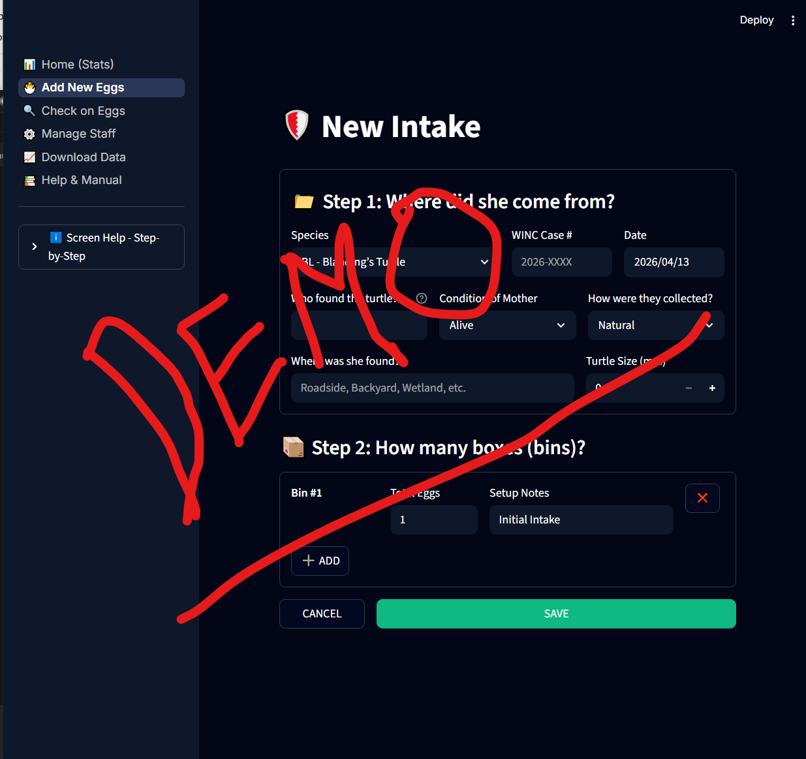

# 🐢 WINC Clinical Operator Manual (v11.2)
**Author:** Kevin Howland | **Target Audience:** Volunteer Clinicians | **Level:** Beginner

Welcome to the **WINC Turtle Incubator Vault**! 

This manual is your complete, step-by-step guide to using the system. It is designed to be simple, clear, and easy to follow.

---

## 📑 Table of Contents
1. [Chapter 1: Getting Started (Login)](#chapter-1-getting-started-login)
2. [Chapter 2: The Dashboard](#chapter-2-the-dashboard)
3. [Chapter 3: New Intake (Establishing a Case)](#chapter-3-new-intake-establishing-a-case)
4. [Chapter 4: Daily Observations & Biology](#chapter-4-daily-observations--biology)
5. [Chapter 5: Reports & Analytics](#chapter-5-reports--analytics)
6. [Chapter 6: Settings & Disaster Recovery](#chapter-6-settings--disaster-recovery)
7. [Chapter 7: Crisis Workflow (Offline Catch-up)](#chapter-7-crisis-workflow-offline-catch-up)

---

## Chapter 1: Getting Started (Login)
*Focus: Signing in securely and understanding shift handovers.*

*Figure 1: The Secure Login Interface*

### Step-by-Step: How to Sign In
1. Open the application.
2. You will see the **Observer Selector** dropdown.
3. Click the dropdown and select your name.
4. Click the button labeled **"START SESSION"**.

> ⚠️ **The 4-Hour Rule:** For security, the system will automatically log you out after 4 hours of inactivity.

---

## Chapter 2: The Dashboard
*Focus: Checking the pulse of the incubator room.*

*Figure 2: The Active Dashboard Overview*

When you log in, you will land on the **Dashboard**.

---

## Chapter 3: New Intake (Establishing a Case)
*Focus: Bringing a new turtle mother and her eggs into the system.*

*Figure 3: Establishing a new clinical case*

When a new turtle arrives, click **New Intake** on the left menu.

### Step-by-Step: Maternal Assessment
1. **Mother Intake Date:** Select the date the mother arrived at the facility.
2. **Conditions of Intake:** Select from LIVING, DOA, DIED IN CARE, or EUTHANIZED. 
   * *Note: If DIED IN CARE or EUTHANIZED is selected, you must enter the "# of Days in Care".*
3. **Carapace Measurement:** Type shell length into **"Carapace Length (mm)"**.
4. **Clinical Mass Gate (Mandatory):** Type the weight into **"Mass (g)"**. *The system will not let you proceed if the weight is 0.0!*
5. Click **"SAVE"**.

---

## Chapter 4: Daily Observations & Biology
*Focus: Updating egg stages, vitality, and fixing mistakes.*

*Figure 4: The Daily Observation grid*

Click **Observations** on the left menu.

### 🛑 THE "NEVER ROTATE" MANDATE
> **CRITICAL RULE:** When observing an egg, **NEVER ROTATE IT**.

### Visual Stage Identification
*    **Stage 1 (S1):** Early Identification (Chalking).
*    **Stage 2 (S2):** Vascular Development.
*    **Stage 3 (S3):** Mid-Incubation.
*    **Stage 4 (S4):** Late-Stage.
*    **Stage 5 (S5):** Pipping Preparation.

---

## Chapter 5: Reports & Analytics
*Focus: Exporting data for the Lead Scientists.*

*Figure 5: The Analytics and Reporting Dashboard*

Click **Reports** on the left menu.

---

## Chapter 6: Settings & Disaster Recovery
*Focus: Advanced tools for Administrators.*

Click **Settings** on the left menu. 

*Figure 6: The System Settings and Disaster Recovery tools*

### Bi-Directional JSON Disaster Recovery
1. Click **"EXPORT FULL BACKUP"** first.
2. Type `OBLITERATE CURRENT DATA`.
3. Click **"RESTORE"** or **"WIPE & SET CLEAN START"**.

---

## Chapter 7: Crisis Workflow (Offline Catch-up)
*Focus: What to do when the internet goes down.*

*Figure 7: Paper Log transcription protocol*

If the facility loses power, use paper clipboards to record data. 
